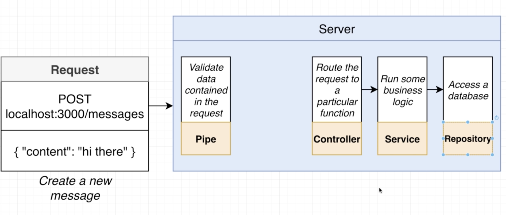
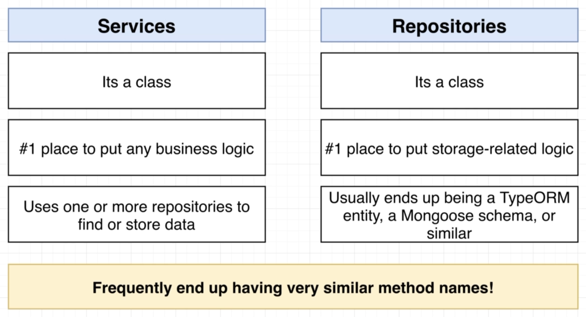
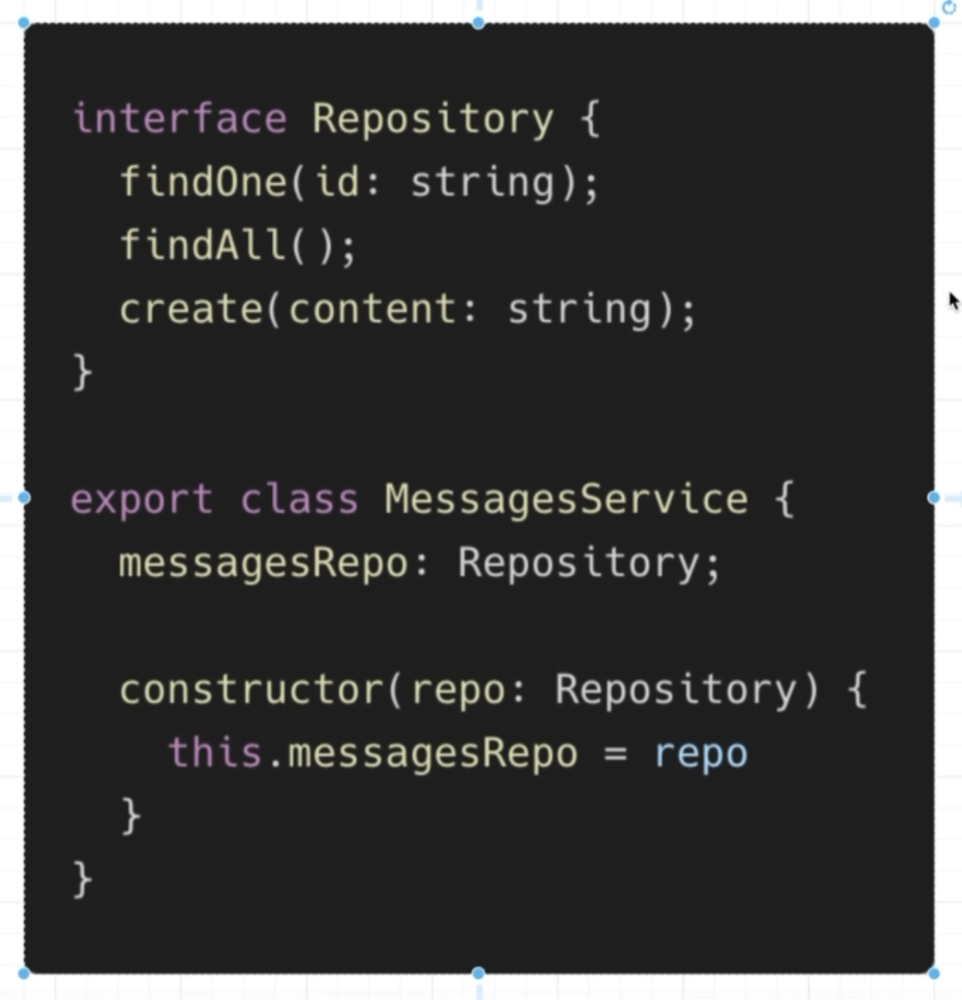
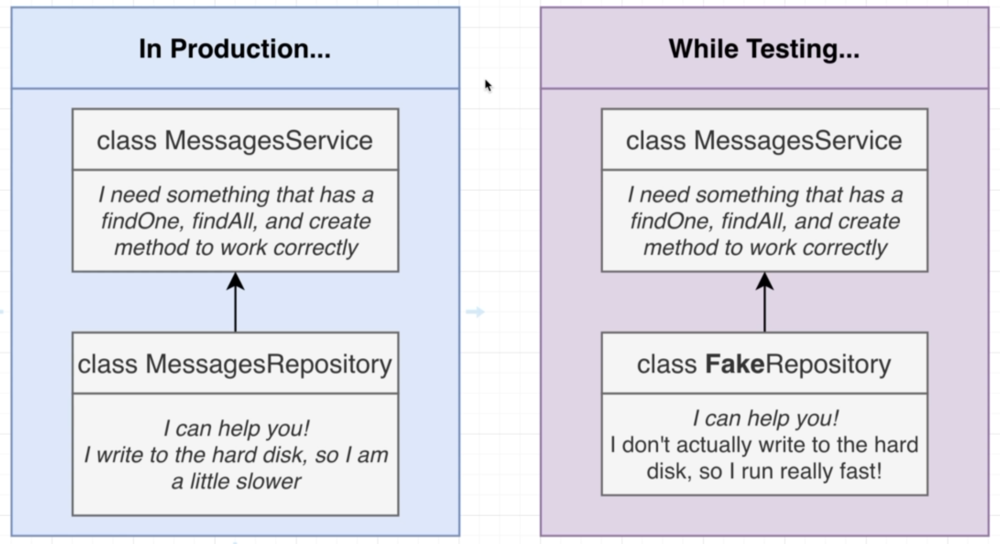
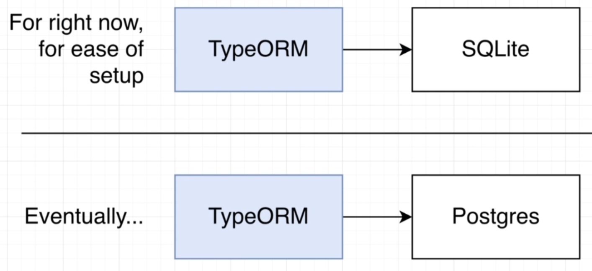
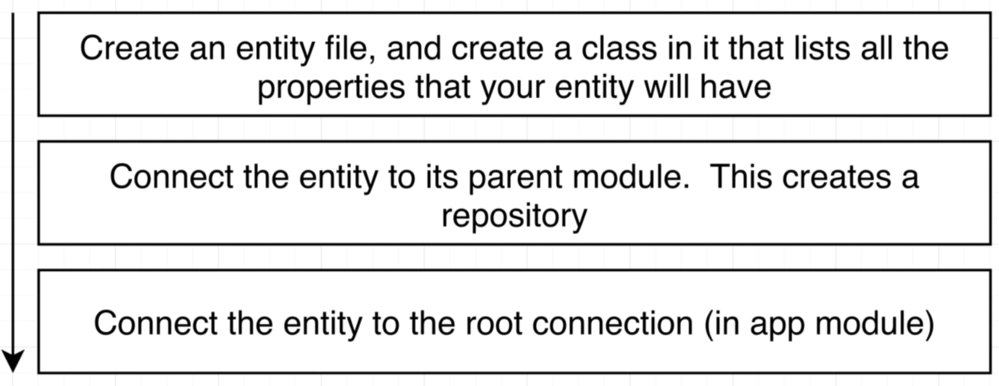
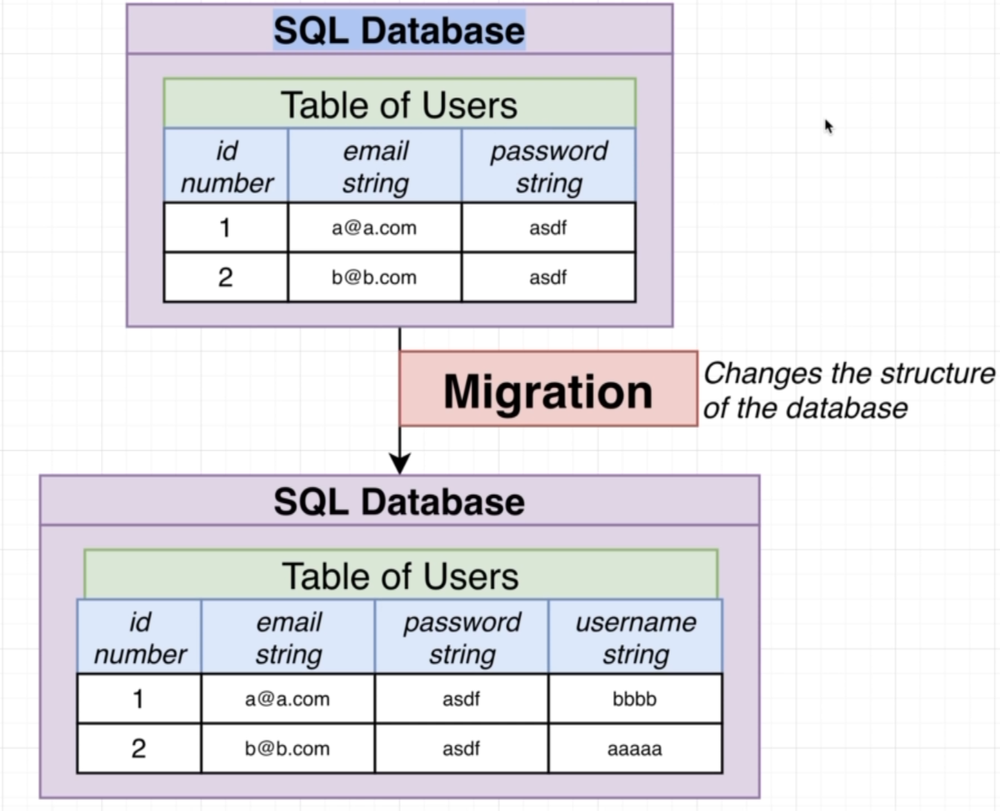

# NestJS Bootcamp

### Student Copy [Combination File]

### Prepared by : [Kushagra Acharya](https://www.linkedin.com/in/kushagraacharya/)

---

# Slide 1 Start

---

# Prerequisite

- Separate notebook/copy for notes
- NVM with Node Installed
- PC with VS Code Installed
- Stable Internet Connection

---

# Introduction & Getting Started

---

## CLI and Project

Firstly, We install nestjs in our machine

```
npm i -g @nestjs/cli
```

Navigate to work directory and run the following

> nest new <project_name>

```
nest new myapp
```

---

## Actions

- We installed nestjs cli globally
- We used that CLI to make a new project

## Result

- In terminal, there is success message of new project creation

## Now?

- Go inside the new project `cd myapp`
- Open VS Code `code .`

---

# Base Structure

- node_modules
  - delete and install `npm i`
- package.json
  - scripts
  - dependencies
- gitignore
  - what and why?

---

# Discussion

- NPM vs Yarn
- NodeJs vs ReactJs vs NestJs
- Framework

---

# Project Structure

- src folder
- test folder

---

# Running the project

- refer to package.json
  - scripts
  - `npm run start:dev`
  - localhost:3000
  - should see `Hello World`
  - edit `app.service.ts` for new Message!

---

# Task!

- Create a project called myapp
- Run the project in browser `localhost`
- Output must be:
  - Hello NestJs
- Submit your task

---

# Congratulations

## You Completed :

- NodeJS Basics
- Backend Concepts
- CLI Concepts
- Capable of making a new NestJS Project
- Running a NestJS Project

---

# Homework :

- NodeJS and NestJS working principle diagram (classwork)
- What is the terminal code to `install` nestjs cli?
- What is the terminal code to `create new nestjs` project?

---

# Viva questions:

- Authorization vs Authentication

---

# Slide 1 End

---

# Slide 2 Start

---

# Project Setup from Scratch

---

## Something from Nothing?

- Will be hard ... very hard .. because we are staring from scratch
- What is scratch?
- We will learn behind-the-scenes stuff
- Know how NestJS works so will make all of Nest easy

---

## Steps

- Open bash
- Go to `D:\backend\nestjs-bootcamp`
- Create a folder called `scratch`
- `cd` into `scratch`
- do `npm init -y` to make `package.json`

---

## Steps

Install the following dependencies from terminal

- `npm install @nestjs/common@9.0.0`
- `npm install @nestjs/core@9.0.0`
- `npm install @nestjs/platform-express@9.0.0`
- `npm install reflect-metadata@0.1.13`
- `npm install typescript@4.7.4`

All are the basic necessary dependencies for NestJS
Open your `scratch` folder in VSCode after installation

---

# package.json

@nestjs/common

> has functions, classes (libs) that we need from Nest

@nestjs/platform-express

> lets Nest use ExpressJs to handle http requests/response

reflect-metadata

> helps make decorators work (more later!)

typescript

> Nest app with typescript

---

# Configure TypeScript

- create file `tsconfig.json` in root
- write the following

```json
{
  "compilerOptions": {
    "module": "commonjs",
    "target": "es2017",
    "experimentalDecorators": true,
    "emitDecoratorMetadata": true
  }
}
```

---

# Nest Module and Controller

---

## Basic Concept of Server


---

## Detail Concept of Server


---

## Nest has special tools for each steps


We will learn each tools in this series

---

## Parts of Nest


---

# Basic Nest App

- to exist as an app
- a simple nest app will contain
  - a controller
  - a module
- which is the minimum criteria for it's existance

---

# Creating the basics of Nest

- in your scratch folder, make `main.ts` file
- main.ts is the 1st file to get executed in any Nest project
- Complete the following code in `main.ts`

```ts
import {Controller, Module} from '@nestjs/common`
```

- these tools provided by nest for us to create our own controllers and modules

---

# Creating a controller

- below import, write

```ts
class AppController {}
```

- decorate the `AppController` with `@Controller()`

---

# What did we do?

```ts
@Controller()
class AppController {}
```

- We made own own controller using a decorator which tells nest that AppController is a controller
- Controller is made to handle and route incoming request
- Inside controller we will creating functions that will be able to handle specific requests

---

# Task!

- Delete this `main.ts` file
- Make a new `main.ts` and do creation of a controller

---

# Method Route in Controller

- import `Get` decorator and use for `getRootRoute`
- Add a method with following content

```ts
import { Controller, Module, Get } from "@nestjs/common";

@Controller()
class AppController {
  @Get()
  getRootRoute() {
    return "Hello Root Route!";
  }
}
```

---

# Now Module

- Module is going to `wrap-up` a controller
- Every app we create must have at least one module
- Create a module below the previous `controller`

---

# Create Module

- create a class `AppModule`
- decorate it with `@Module()`
- Try it yourself!

---

# Passing configuration object to Module

- There is error in Module decorator
- It needs configuration as

```ts
@Module({
  controllers: [AppController],
})
class AppModule {}
```

- controllers property will list all controllers in the application

---

# What will happen?

Whenever our nest app starts

- It will look into this `AppModule`
- It will find all the `Controllers` listed in `Module`
- Automatically creates instances of all controller classes
- So `AppController` instance will be created
- Will check all the decorators, eg: `@Get()`, and define `route handlers`

---

# Review

## What we did :

- main.ts as entry point
- Nest needs Module and Controller so we made both in main.ts
- `Module` wraps `Controller`
- `Controller` wraps `routes` with `methods` like `@Get()`
- Module needs `configuration`

---

# Bootstrap

- main entrypoint needs a function
- async function called bootstrap()

```ts

    import {NestFactory} from '@nestjs/core

    async function bootstrap(){
        const app = await NestFactory.create(AppModule);
        await app.listen(3000);
    }

    bootstrap();
```

---

# Run Application

Terminal

- make sure you're inside the project in cmd
- `npx ts-node-dev src/main.ts`
- will run the app
- "Nest Application Successfully Started"
- other program using port 3000?
- now see `localhost:3000`

---

# Congratulations

You've completed:

- Core understanding of Nest and its components
- Module and Controller concept and creation
- main.ts file structure and use

---

# Homework

- create a Nest project from scratch where:
  - in main.ts there is a module
  - module will have `Hello EEC Student`
  - submit the code via github from your account in discord

## Viva questions:

- Module and Controller

---

# Slide 2 End

---

# Slide 3 Start

---

## Setup and Modification

---

## Extensions

Install the following in VSCode

- [NestJS](https://marketplace.visualstudio.com/items?itemName=ashinzekene.nestjs)

- [Prettier](https://marketplace.visualstudio.com/items?itemName=esbenp.prettier-vscode)

---

## Structuring

- Currently we have all our classes in a single file
- This is not a very good approach for development
- We will now extract the app controller and the app module to a separate file

---

# Before that: Conventions


---

# Creating files

- Create `app.controller.ts` file
- Move your `AppController class` to this file
- Fix any imports if necessary
- Do the same for `AppModule class` in `app.module.ts` file

---

# main.ts

- The `main.ts` file should now only contain the `bootstrap()`
- But you will need to fix the import for `AppModule` in _main.ts_ as it is being used as `NestFactory.create(AppModule)`

---

# Run the application

- `npx ts-node-dev src/main.ts`

---

# Discussion

- Importance of naming conventions
- What is separation of concern
- Help in project structuring
- Project scalability

---

# Congratulations

## Level Completed!

- Structuring for files and naming

---

# Slide 3 End

---

# Slide 4 Start

---

## Routing Decorators

---

## Decorators

- In your `app.controller.ts` file you can see some decorators
- `@Get()`
- `@Controller()`
- Decorators start with `@` and may or may not take arguments

---

## Routing Rules

- `@Conroller()` decorator can take argument to change routing routes
- `@Get()` decorator as well can take arguments to modify routing
- Run the project to test any routing changes in upcoming slides

---

## Get Route

```ts
@Controller()
export class AppController {
  @Get("/one")
  getRootRoute() {
    return "hey there!";
  }
}
```

- Test this change in your `localhost:3000/one`

---

## Controller Routing

```js
@Controller("/app")
export class AppController {
  @Get("/one")
  getRootRoute() {
    return "hey there!";
  }
}
```

- Figure out the endpoint for result 'hey there!'
- We can see that `controller routing` changes for all inner routes functions for higher level routing

---

## Task

- Create another method inside AppController as `getByeThere` which returns the string`'bye there'` with a get-decorater having argument as `'bye'`
- Test your output in localhost

---

# Run the application

- `npx ts-node-dev src/main.ts`

---

# Discussion

- Decorators
- Routing
- Arguments

---

# Congratulations

## Level Completed!

- Routing with Decorators

---

# Slide 4 End

---

# Slide 5 Start

---

## Messages App

---

## Previously

- We learned that without the help of CLI we can make basic Nest project
- CLI gave us a lot of files and packages which are not mandatory
- With very less files and libraries we can build a simple API system
- This gave us the basic idea of working of Nest

---

## New Project

- close the vscode
- close any terminals
- open your `workspace` folder and create `nest-backend`
- open terminal inside `nest-backend`
- perform `nest new messages` to create new project
- `cd messages` and `code .` to open it in new vscode

---

## Messages

- Simple Nest app
- Store and Retrieve messages stored in a plain JSON file

---

## Overview

- We will have 3 routes
  - list all message
  - list message by id
  - create message

---

## Retrieve message list

- Concept of getting all messages in a list
- GET request `localhost:3000/messages`
- Will not have
  - **Pipe** : as there is not request validation
  - **Guard** : as there is no auth system in project
- Will have
  - **Controller** : to route the request to a function
  - **Service** : logic to access JSON and get message
  - **Repository** : treat JSON file as database (make-do)

---

## Receive message list (diagram)


---

## Send single message (diagram)



---

## Receive single message with id (diagram)


---

## Overview

- So we are making `Controller` to handle messages routing
- `Service` for logics of accessing and managing data
- `Repository` for data storage
- But all these files we are going to create is inside a `Module`
- A module should contain only similar types or relatable files
- As a result the module we are working on will have only `message` related files

---

## Overview (diagram)


---

## Open project in VSCode

- Compared to `scratch` project there are a lot of files due to project generation from CLI
- See `scripts` in `package.json` where `"start:dev"` is very important now to run the server in development mode
- Try in terminal: `npm run start:dev` inside the message project

---

## eslint

- by default Nest makes use of `eslint`
- see file `.eslintrc.js`
- eslint is a command-line tool which highlights possible erros, formatting error in your project
- eslint can be disabled for the project by commenting the whole object inside module.exports
- this is sometimes done if you have a better error highlighting tool than eslint and is purely dependent on personal preference
- this is an optional process.
- for me I am going to disable eslint, you can skip it.

---

# Discussion

- GET
- POST
- GET by ID

---

# Congratulations

## Level Completed!

- Planning for API development with files needed

---

# Slide 5 End

---

# Slide 6 Start

---

## Messages Project Part 2

---

## Previously

- We learned that what are the types of ROUTES we are going to make
- What is GET and GET with id
- What is POST
- Project setup from CLI

---

## To Run Project

- `script` in `package.json`
- `start:dev` to start the project in development mode
- Make change to project and save to see changes
- Try this yourself

---

## Inside `src` folder

- CLI gives us generated files which is ready to run
- You are already familiar with
  - `app.contorller.ts`
  - `app.module.ts`
- There maybe some extra codes & files in these files which we will discuss gradually
- So for the sake of learning perfectly please delete all files inside `src` except `main.ts`
- Notice there is import error `main.ts` which is prefectly fine to have.

---

## Overview Revision

- All sub-components falls under MessagMeodule
  

---

## Generating Files for MessageModule

- To Generate Module, from terminal

```
 > nest generate module messages
```

- A file has been created as `src/messages/messages.module.ts`
- in `main.ts` hook your NestFactory with `MessageModule` by replacing `AppModule`

---

## Generating Controller

```
nest generate controller messages/messages --flat
```

- See that 2 files are created and 1 file is updated
- Let's see what the CLI actually did

---

## CLI action breakdown


---

## Adding Routes to Controller

- Add route handlers inside the class MessageControllers
- We have 3 routes
  - get all messages
  - get single message by id
  - post single message

---

## Routes Revision


---

## Task : Create routes

### Option 1 : Route names for endpoints

- `@Get('messages')` for `listMessages()`
- `@Post('messages')` for `createMessage()`
- `@Get('messages/:id')` for `getMessages()`

> Create routes yourself

---

## Task : Create routes

### Option 2 : Repeting route can be promoted to controller

- `@Controller('messages')`
- `@Get()` for `listMessages()`
- `@Post()` for `createMessage()`
- `@Get('/:id')` for `getMessages()`

> We are going to follow option 2

---

## Task : Create routes

- Create the routes needed yourself

---

## Solution

- `message.controller.ts`
- First import the `Get` and `Post` from `@nestjs/common`

```js
import { Controller, Get, Post } from "@nestjs/common";
```

---

## Solution

- Then create functions inside the controller as

```ts
@Controller("messages")
export class MessagesController {
  @Get()
  listMessages() {}

  @Post()
  createMessage() {}

  @Get("/:id")
  getMessage() {}
}
```

---

## Handling Requests

- As we have `Post` request, we need to learn how to handle body of the incoming request in` createMessage()`

- For `Get` with `wildcard` (:id) value we need to learn how to handle the `id` value in the incoming request in `getMessage()`

---

## HTTP Request Structure


---

## Extracting important parts of Request


---

## Using Argument Decorators

For body

```ts
@Post()
createMessage(@Body() body:any){
  console.log(body);
}
```

For Wildcard

```ts
@Get('/:id)
getMessage(@Param('id') id:string){
  console.log(id);
}
```

---

## Final Look

```ts
@Get
listMessages(){}
```

```ts
@Post()
createMessage(@Body() body:any){
  console.log(body);
}
```

```ts
@Get('/:id){
  getMessage(@Param('id) id:string){
    console.log(id);
  }
}
```

## Next Class

- Validation and Pipes

---

# Slide 6 End

---

# Slide 7 Start

---

## Messages Project Part 3

---

## Previously

- We learned about decorators for controllers and API methods
- How to write functions in controllers
- How to do @Get and @Post
- Different parts of HTTP Request

---

## Validation

- For the @Post method we have we know that it has a @Body
- This body is used to send data from user side to server side
- @Get methods dont have body
- To write a better @Post method, we should be able to do validation

---

## Validation

- Validation of the incoming body
- Should check if the body is empty?
- Should check if the body is string but int is passed?
- PIPES can be used to perform these kind of checks to data
- We can make our own PIPES or use the PIPES give by NestJS itself.

---

### Pipe


---

## Validation Pipe

- Is a type of Pipe given by NestJs
- Built into Nest
- Helps to handle validation of data

---

## Setup Pipe

- Open `main.ts`

```ts
import { ValidationPipe } from "@nestjs/common";
```

- inside ` bootstrap()`` function just  below  `const app` decleration

```ts
app.useGlobalPipes(
  //globally implemented
  new ValidationPipe() //validates all incoming requests
);
```

---

## Setup Automatic Validation


---

## How to Setup

- `Step 1` : Global Validation is done once (done)
- `Step 2,3,4` : Every Single Time When you have to use Pipe on Route Handler

---

## Step 2 : DTO

- Class we are going to create is a `DTO` or `Data Transfer Object` (more on this later)

- inside `src>messages` create folder `dtos` create a file
  - `create-message.dto.ts`
- give class name `CreateMessageDto` and export it
- create a property inside class as `content:string`
- This property is the `@Body` of `@Post createMessage` method
- Compete this!

---

```ts
export class CreateMessageDto {
  content: string;
}
```

---

## Step 3 : Import Validator

- Import {IsString} from 'class-validator';
- You must install `class-validator` from terminal first
- Also install `class-transformer`

```
 > npm i class-validator class-transformer
```

- Start server once again

---

## Step 3: Use validator

```ts
import { IsString } from "class-validator";

export class CreateMessageDto {
  @IsString() //valida tor
  content: string;
}
```

- This make sures that content is actually a string!

---

## Step 4 : Apply Class to Request Handler

- Go to `messages.controller.ts`
- Import `CreateMessageDto`
- Change `body` type from any to `CreateMessageDto` in the @Post method

---

## Step 4 : Example

```ts
...
import {CreateMessageDto} from './dtos/create-message.dto';

@Controller('messages')
export class MessagesController{

@Post()
createMessage(@Body() body: CreateMessageDto){
console.log(body);
}

```

---

## Make Request via Postman

- Send Post request to `http://localhost:3000/messages`

```json
{
  "content": 123
}
```

- See the output

---

## Testing Requests

#### Test 1

```json
{
  "content": "hi there"
}
```

#### Test 2

```json
{
  "content": null
}
```

---

## Testing Requests

#### Test 3

```json
{}
```

#### Test 4

```json
{
  "contentsz": "hi"
}
```

---

## Step 2 : DTOs Explain

- Goal of DTOs is to carry data between two places
- DTO usually dont have any kind of functionalities
- They are just the representation of data

---

## Step 2 : DTOs Explain


---

## Step 3 : Validator Explain

- Validation Rules are the rules that check for data validity
- These rules are `applied` to the DTO
- To do this we installed `class-validator` & `class-transformer`;

---

## Step 3 : Class Transformer [see doc](https://github.com/typestack/class-transformer)

- Even though we did not exclusively use it, this transformer works for us behind in the shadows
- It converts the plain (literal) objects to class (constructor) objects
- Which means it convets `{}` objects to `class` instances objects
- Which means it converts `json` objects to `ES6 classes`
- Previously We converted `{"content":"hi there"}` to object of `class CreateMessageDto` using this package

---

## Step 3 : Class Validator [see doc](https://github.com/typestack/class-validator)

- Handles validatation of property of class using decorators
- See decorators in documentation inside [Validator decorators](https://github.com/typestack/class-validator#validation-decorators)
  - @IsString()
  - @IsInt()
  - @IsPositive()
  - etc.

---

## Working from Request to Pipe

- Request Model


---

## Working from Request to Pipe

- Validation Pipe Handling


---

## Solution

---

## Next

- Services and Repositories

---

# Slide 7 End

---

# Slide 8 Start

---

## Messages Project Part 4

---

## Previously

- We learned in detail about validation with pipes
- DTOs and its use

---

## Services and Repositories

- So after Controller we now focus in Service and Repositories

  

---

## Compare : Services and Repositories



---

## Differences

- Business Logic : Calculation logic
- Storage Logic : Read Write Info to File / DB logic

- A `Service` can use multiple repo available to perform its logic

  - Get data from multiple source and perform combination operations

- `Repository` end up as wrapper around a `storage library` like TypeORM, Prisma, Mongoose Schema etc.

---

### Confusion Case


---

## Clearing Confusion

- Repository perform all its function related to storing, creating, reading values from the source/db/file as instructed

- Service peforms the logic behind how the data is combined, requested, listed and much more business logic

> Currently you might think that if the functions of Service are placed inside the Repository itself then we would not need service class and it is very fine to think that way. Later this confusion will be cleared

---

## Creating from Scratch

- src > messages > New Files

  - `messages.service.ts`
  - `messages.repository.ts`

- open the repo file and create the `class MessageRepository`
- export the class

---

## Make Functions for Repository

- inside the class, make async functions as :

  - `findOne(id:string){}`
  - `findAll() {}`
  - `create(message:string){}`

- import helper functions to read/write

```ts
import { readFile, writeFile } from "fs/promises";
```

---

## Create a file to store data

- In project root make a json file called `messages.json` and `messages.sample.json`
- in sample file write following json without comments to remember

```json
{
  "12": {
    //id of the message as key of message object
    "content": "hi there!", // message value
    "id": 12 // the id it belongs to
  },
  "13": {
    //id of the message as key of message object
    "content": "hello world!", // message value
    "id": 13 // the id it belongs to
  }
}
```

---

## Repository `findOne`

- Now we write `findOne` function which will
  - Open the file and read it
  - Read the contents as JSON and parse as readable object
  - Get by id and return

```ts
async findOne(id:string){
  const contents = await readFile('messages.json','utf8');
  const messages = JSON.parse(contents); //our json to message object
  return messages[id];
}
```

---

## Repository `findAll`

- Now we write `findAll` function

```ts
async findAll(){
  const contents = await readFile('messages.json','utf8');
  const messages = JSON.parse(contents); //our json to message object
  return messages; //which returns all messages
}
```

---

## Repository `create`

- Now we write `create` function where
  - open the file and read contents
  - randomly generate id (int) and add message to file as string

```ts
async create(content:string){
  const contents = await readFile('messages.json','utf8');
  const messages = JSON.parse(contents); //our json to message object
  const id = Math.floor(Math.random() * 999); //floor for round to int
  messages[id] = {id,content:content};
  await writeFile('messages.json', JSON.stringigy(messages));
}
```

---

## Repository in Completed

- Now open service file

---

## Service

- create `class MessagesService{}`
- import `MessageRepository` on the top
- make a constructor to initialize the repo

```ts
export class MessageService {
  messageRepo: MessagesRepository;

  constructor() {
    //Service is creating a depedency!
    this.messageRepo = new MessageRepository();
  }
}
```

---

## Dependency? Very Important

- When is a constructor created?
  - When object is initialized!
- When in MessageService's object created?
  - When it's constructor works flawlessly!
- What might stops the constructor to work flawlessly?
  - If MessagesRepository is absent or there is some problem!
- So here a class is creating a dependency inside it's constructor
  - DO NOT DO THIS EVER!

---

## So what is the solution?

- We will fix this LATER with very familiar and popular programming technique known as dependency injection!
- Dependency is a very imporatant topic is any programming practice!
- But not now, lets continue as it is.

---

## Continue MessageService

```ts
...
export class MessageService{
  messageRepo : MessagesRepository;
  constructor(){
    this.messageRepo = new MessagesRepository();
  }

  findOne(id:string){
    return this.messageRepo.findOne(id);
  }
}

```

- do same for find all and create yourself!

---

## Connect Service to Controller

```ts
export class MessageController {
  messageService: MessagesService;

  constructor() {
    //do not do this in real app
    this.messagesService = new MessagesService();
  }

  @Get()
  listMessages() {
    return this.messagesService.findAll();
  }
...
```

---

## Connect Service to Controller (continued)

```ts
...
  @Post()
  createMessage(@Body() body: CreateMessageDto){
    return this.messagesService.create(body.content);
  }

  @Get('/:id')
  getMessage(@param('id') id:string){
    return this.messagesService.findOne(id);
  }
}
```

---

## Check your `message.json`

- Make sure the file is there and has `{}` inside it

---

## Ready to Test

- Restart the server
- Test `GET` for `messages` as findAll
- Test `POST` for `messages` with body as `your_name` as create
- Test `GET` for `messages/<id>` as findOne

> id is randomly generated so please recheck your `message.json`

---

## Next

- Error handling, 404

---

# Slide 8 End

---

# Slide 9 Start

---

## Messages Project Part 5 : Handling Errors

---

## Previously

- We learned about Services and its use
- How to Connect - Services + Repository + Controller

---

## Errors

- If we try to get a single message with a random `id` like `123123`
- We dont get a specific error
- We just get a blank response from the API
- We should be giving a specific error message

---

## Controller with NotFoundException

- In MessageController
- import `NotFoundException` from `@nestjs/common`
- Now inside the route handler which Gets by id
  - `const message = await this.messagesService.findOne(id);`
  - this will open the file and get the message with id as a promise
  - then in a if statement `if(!message)`
  - `throw new NotFoundException('message not found');`
  - `return message;`
- Check this route with or without valid `id`

---

## Other Exceptions

- Inside
  - `@nestjs>common>exceptions`
  - NestJS provided exception for you

#### Some commonly used are:

- BadRequestException
- GatewayTimeOutException
- UnAuthorizedException
- etc

---

### Dependency Injection Fix

- A little bit complicated and challenging concept
- Understanding why it is done?
- How to do it will be easy if you understand `Why`

---

## Dependency In Our Project


---

## Mapping the dependencies

- Service depends on Repository to work correctly
- So if there is no Repository to exist Service wont work correctly
- Controller depends upon the Service
- There is very clear depedency between these classes

---

## Creating on the Run

- To make our system work
  - MessageService is making MessageRepository object in it's constructor
  - Which means when we are creating an `object` of `MessageService` class, this class is `automatically` creating it's dependency of MessagesRepository
- In the same way when we create an instance of `MessagesController` it automatically creates its dependeny of `MessageService`

---

## Inversion of Control Principle


---

## It means

- If you want to write `REUSEABLE` code, the classes you have written `SHOULD NOT` create instances of its dependencies `ON ITS OWN`

---

## So this makes

- Inside MessagesController

```ts
constructor(){
    this.messagesService = new MessagesService();
}

```

- This principle make the following code BAD code
- Which means we should not try to create dependencies inside the class on our own

---

## Variations

- Bad
- Better
- Best

---

## Bad Practice


---

## Better Practice


---

## Best Practice


---

## Best Practice



---

## Why Interface

- In the Better Practice
  - The repo being passed to the constructor has to be MessageRepository
  - Other types of Repository is not entertained by the constrctor
- In Best Practice
  - The repo is generalized with an interface AND as long as any class satisfies the condition of interface Repository, it can be used by the MessageService

---

## So why?

- Question
- Why would MessageService need any other repository other than MessageRepository?
- It is not made to work with other type of Repository so why take a general form of interface which is accepted by the MessageService constructor?

---

## Reason



---

## Remember

Not always Inversion of Control helps!

If you follow inversion of control and start doing dependency injection to create a controller then a single line like this

```ts
const constroller = new MessagesController();
```

will be more than 2 lines which is a waste of time and effort.

```ts
const repo = new MessagesRepo();
const service = new MessagesService(repo);
const controller = new MessagesController(service);
```

So IoC is done only when it is suitable

---

## Dependency Injection

- So to solve this problem of creating massive number of objects just to create one object
- Like if a controller requires 3 services object, we have to make 3 services first and the pass it to the controller object

```ts
const service1 = new Service1();
const service2 = new Service2();
const service3 = new Service3();
const controller = new Controller(service1, service2, service3);
```

- We now look into dependency injection

---

## Working


---

## Working

- Nest DI Container / Injector is an object which

1.  `Stores` list of all the classes and their dependencies
2.  `Stores` instances that you have created

---

## Working

- When you create a NestJS app, DI Container is created for that app
- DI container stores all the class in the app except the Controllers
- The intelligent factor of DI is that if a class `MessageService` has a contructor that needs `MessagesRepository` to work, which is the dependency of the service, the DI stores the MessagesRepository (dependency) while storing the MessageService (class)
- The DI stores a list of relation map which describes which class needs which dependency
- Again after storing `MessageService` it creates a new relation of `MessagesRepo` which might not have any dependency

---

## Working


---

## Working

- So we now know that, at startup, the DI Container stores list of classes and their dependencies inside it which are mainly NOT `Controllers`

- After finishing all classes and dependencies, now the time comes to create the Controllers

```ts
export class MessagesController {
  messagesService: MessagesService;
  constructor(messagesService: MessageService) {
    this.messageService = messagesService;
  }
}
```

---

## Working

- So when its time to create the controller, these steps occur

1. We ask the `Injector` to create instance of our `Controller`
2. Injector looks at the `constructor` of the Controller and looks at what does the Controller has as dependencies
3. Injector sees that we need a copy of `MessagesService` and finds that it needs `MessagesRepo` first (see diagram)
4. Then it finds that `MessagesRepo` has no dependencies
5. So it makes the instance `repo` then make instance of `service`
6. When repo and service are made it makes a `controller` we need and gives us the instance
7. When it makes the instances it stores it to list number `2`

---

### Working


---

### Working

##### Goals of Injector

- Register all different classes and its dependencies
- Create Controllers using the classes and dependencies
- Give instance Controllers back when requested
- Do IoC and manage it itself
- The most useful part is that, if any other `Controller` like `UserController` needs instances of `messageRepo` and `messageService`, rather than making new instances, it reuses the previously created instances (more later)

---

### Working Flow


---

### Refactoring

- We now implement what we've learned to our existing code

---

### Service Refactor

- something like this for constructor in your `messages.repository.ts`

```ts
messagesRepo:MessagesRepostory;

constructor (messagesRepo:MessagesRepository){
  this.messages = messagesRepo;
}

```

or this typescript magic!

```ts
// messagesRepo:MessagesRepository;

constructor(public messagesRepo:MessagesRepository){

}
```

---

### Controller Refactor

- in your `messages.controller.ts`

```ts
constructor(public messagesService:MessagesService){

}
```

> We will have no change in our `messages.repository.ts` since there is no dependency for the repo

---

### Refactoring

- Now all we've done is mention the dependency for the respective classes
- So how do we let the DI Controller know that it should create the classes and the instances?
- In our case, how do we let the DI Container know that it should make the instance of `MessagesService` since it will be later used by the `MessagesController`?
- We do this using the provided decorators

---

### DI Flow


---

### Decorator

- We import decorator and apply it to class
- Add the decorated classes to module

---

### Decorator Injectable

- in `messages.service.ts`

- import `Injectable` from `nestjs/common`;

- decorate `MessagesService` class with `@Injectable()`

- do same for the `messages.repository.ts`

- we dont have to do this for any Controllers

---

### Adding to Modules

- open `messages.module.ts`
- import `MessagesService` and `MessagesRepository`
- add the classes as providers

```ts
@Module(
  {
    controllers: [MessagesController],
    providers: [
      MessagesService,
      MessagesRepository
    ]
  }
)
```

> providers = things that can be used as dependencies for other classes

- refactor completed!

---

### Run

- Close the server and re-run it
- Check if all things are working correctly

---

### DI Conclusion (Open Image of DI Container)

- all serives and repos should have dependency injected
- this is the BETTER approach, instead of the BEST approach
- whenever a instance is made by the DI Container, it will reuse that instance if you ask it again
- 1st list keeps the map of what is created
- 2nd list keeps the instance that are alive
- all instances asked by the app is given from the 2nd list

---

### DI Conclusion

- What is the benefit of DI over previous approach?
  - It is not suitable always
  - Testing individual classes is very easy
  - Finding bugs is super easy
- Writing testing in super helpful and easy

---

### We completed!

- NestJS Architecture - DI with Services and Repo

---

### Next

- We will starting NestJs Architecture with Modules with DI

---

# Slide 9 End

---

# Slide 10 Start

---

## Module Architecture

---

## About

- In this project we will try to imitate how computer work
  

---

## Overview of Project


---

## Modules DI

- We will create modules as discussed previously
- Power Module
- CPU Module
  - Will need Power Module
- Disk Module
  - Will need Power Module
- Computer Module
  - Will need CPU and Disk Module

---

## Create new Project

```bash
 nest new di
```

- delete all except `main.ts`

```
nest g module computer
```

```
nest g module cpu
```

```
nest g module disk
```

```
nest g module power
```

---

## Generate Services

```
nest g service cpu
```

```
nest g service power
```

```
nest g service disk
```

---

## Generate Controller

```
nest g controller computer
```

---

## AppModule

- in `main.ts`
- import and use `ComputerModule`

---

## Approach

- So we start usually from the module which does not depend on any other module, which in our case is the `PowerModule` where we need the `PowerService`

- inside `power.service.ts` make function as

```ts
supplyPower(watts:number){
  console.log(`Supplying ${watts} of power`);
}
```

---

## Sharing Services

- So in the figure about our project we see that `PowerService` is shared by `CPU Service` and `Disk Service` from two different modules
- This is new to us!
- CPU services needs instance of Powerservice and same for the Disk Service

---

## Sharing Services


---

## Sharing Service

- We already have done/know how to share services within the same module from our previous classes.

  To inject serviceA inside serviceB we do:

1. make @injectable for ServiceA
2. add ServiceA to ModuleA's list of providers
3. define ServiceA object in ServiceB's constructor

---

## Sharing outside Module


---

## Sharing outside Module (1)

- in `power.module.ts`
- there is already `providers`
- here the `PowerService` in providers list can be accessed by only this module
- which is private nature by default
- to make it accessible from other module we add a new property to @module

```ts
exports: [PowerService];
```

---

## Sharing outside Module (2)

- in `cpu.module.ts`
- import the `PowerModule` which has the exported `PowerService`

```ts
imports: [PowerModule];
```

---

## Sharing outside Module (3)

- in `cpu.service.ts`
- define the constructor and add `PowerService` dependency to it

```ts
constructor(private powerService:PowerService){

}
compute(a:number, b:number){
 console.log('Drawing 10 watts of power from power service);
 this.powerService.supplyPower(10);
 return a+b;
}
```

---

## Disk Service

- Analyse the process for DiskModule and complete until you navigate to `disk.service.ts`

```ts
getData(){
  console.log('Drawing 20 watts of power from power service);
  this.powerService.supplyPower(20);
  return 'data';
}
```

---

## Consuming Multiple Module

- For the last step, out `Computer Module` should consume CPU and Disk Module
- Now lets export CPU and Disk Services in their respective @Module
- in `disk.service.ts`

```ts
@Module([
  exports: [DiskService]
])
```

> do same for `CPUService`

---

## Computer Module

- now we import 2 modules to the computer module as

```ts
@Module([
  imports: [CpuModule,DiskModule],
  controller: [ComputerController]
])
```

---

## Create the Computer Controller Function

- create constructor which will have `cpuService` and `diskService`

- make a @Get method run() as

```ts
run(){
 return [
   this.cpuService.compute(1,2);
   this.diskService.getData();
 ]
}
```

- save all and start project
  > npm run start:dev

---

## Test

- Make GET request from postman
- You should get

```json
[3, "data!"]
```

- which is the result of 2 services CPU and Disk

---

## Conclusion


---

## End

- You will have to do a project for next class and then we will start database!

---

# Slide 10 End

---

# Slide 11 Start

---

## Project Time!

---

## About

- We are going make API for an app : Used Car Pricing API

---

## Overview of Project


---

## Start

- generate new nest project called 'mycv' as MyCarValue

---

## Routes Discussion


---

## File Structure


---

## Separting Module


---

## Making Modules

- Since in this project we will be using database, lets not create the repo at first
- We will leave it for later

- Open terminal and make modules

```bash
nest g module users
```

```bash
nest g module reports
```

---

## Create Controllers

```bash
nest g controller users
```

```bash
nest g controller reports
```

---

## Create Services

```bash
nest g service users
```

```bash
nest g service reports
```

---

## Check your files

- see if all modules, service, controllers are created or not

- see `app.module` and check @Module configurations like imports,controllers,providers

- check if everything works

- you dont have to delete anything (not yet)

---

## Next

- Diving into Database!

---

# Slide 11 End

---

# Slide 12 Start

---

## Project Time! Databases

---

## About

- We learn about database setup in nest from scratch

---

## Types of DB


---

## Library

- TypeORM interfaces easily with various types of databases easily

- Mongoose is noSql db which is easily used in NestJs

---

## TypeORM



---

## Installing libraries for DB

```bash
npm i @nestjs/typeorm typeorm sqlite3
```

- typeorm library
- @nestjs/typeorm - makes typeorm work with nestjs
- db as sqlite3

---

## Application Diagram


---

## Explanation

- AppModule is the main module which holds other 2 module
- DB Connection is done to AppModule which can shared to other modules automatically
- In both user and report modules there are Entity files, which is similar to dto or model
- Repostory files are not created as we did for json files because we are using db this time

---

## Create Connection

- in `app.moddule.ts`
- import `TypeOrmModule` from @nestjs/typeorm;

```ts
imports: [
  TypeOrmModule.forRoot({
    type: "sqlite", //type of db
    database: "db.sqlite", //name of db
    entities: [], //list of entities,
    synchorize: true,
  }),
  UsersModule,
  ReportsModule,
];
```

- this sets the connection to sqlite database, the forRoot will share this to whole project so other modules can use it

---

## ESLit (Optional)

- disable eslint as `.eslintrc.js`

```bash
 module.exports = {}
```

---

## Start the app from terminal

- run the app
- notice the `db.sqlite` file in root
- you can see raw db data in this file which will be encoded

---

## Diagram

- See diagram about the application
- We just setup connection
- We now create entity file and use it
- TypeOrm and Nest will automatically create repositry for these entities using the database!

---

## Create Entity



---

## Create Entity (1)

- in `user` folder create `user.entity.ts`
- import {Entity, Column, PrimaryGeneratedColumn} from 'typeorm' package
- these 3 are the decorators which we have imported from typeorm

then we create a class

> we are calling it User not UserEntity

```ts
export class User {
  //list the props of user which we expect
  id: number;
  email: string;
  password: string;
}
```

---

## Decorate

```ts
@Entity()
export class User {
  @PrimaryGeneratedColumn()
  id: number;
  @Column()
  email: string;
  @Column()
  password: string;
}
```

---

## Connect to Parent Module (2)

- in `user.module.ts`

```ts
@Module({
    imports: [
        TypeOrmModule.forFeature([User])
    ]
})
```

- this step creates the repository of user for us

---

## Connect Entity to Root Module (3)

- in `app.module.ts`

```ts
entites: [User];
```

- this connects User entity to app module

---

## Steps explained

- in `1` we made an entity that represented the user data and called in entity, it also had some decorators to let the db know the properties

- in `2` we connect the `user entity` to the `user module` which in theory will create the `user repository` (figure)

- in `3` we connect the `user entity` to `app module` which helps in root connection

---

## Start

- stop the project and start again, there should be no error

- this should have created the `UserRepository`

---

## Report Entity

- same steps as User Entity steps 1,2,3
- make entity file

```ts
@Entity()
export class Report {
  @PrimaryGeneratedColumn()
  id: number;
  @Column()
  price: number;
}
```

- perform steps 2 and 3 as required and re-run the project

---

## Extension

- for `db.sqlite` install extension `sqlite` by _alexcvzz_ from vscode
- use this extension by Ctrl + Shift + P
- should see SQLite Explorer in VSCode Left Panel

---

## What we did till now

- in app module we setup typeOrm with sqlite database
- we made `entities` with `decorator` which help us define structure of a `module` data type
- we specified entites here which are needed to make `repository`
- we gave sync as true, so what is that?
- lets understand what is migration in db!

---

## Migration



---

## Migration

- a table has `same` data strucutre wheather we add or remote data
- but if we want to `change`(add/remove) any columns we have to do migration
- it is a piece of code which will change the structure of our table : `migration`
- the image above migrates table by adding a new column of `username` as `string`

---

## Migration

- in our project we have not done any migration
- not even created any manual databases
- this `synchronize` is always used in development environment
- this looks into our entities and create `tables` as required
- this is the feature of typeOrm which is called `synchronized` feature which works when it is set to true which means it also handles migrations

---

## How TypeOrm builds table by decorator

- **@Entity** helps tOrm to create a table in sqlite db called what the class name is but in plural

- **@PrimaryGeneratedColumn** will generate a column will server as id and is always automatically generated as a number while adding a row

- **@Column** decorator will create a column with given type

This is how typeOrm makes the table while looking into the repo

---

## Diagram (typeOrm)


---

## Sync

- if we add any additional props to User entity, the `synchronize` will update the table, and do the migration automatically!
- which is very helpful
- if we did not use the typeOrm, we should write migration manually

---

## Repository

- remember the figure of Application Diagram?
- look at it and you'll see Repository
- which we have not created
- as it is easily handled by typeOrm by using the entity we created a while ago

- UserRepositry and ReportRepository is available and we are using this using the dependency injection technique we learned in last class

---

## Overview of Repo


---

## Repository

- you just saw a set of methods provided by repo
- this methods helps to manipulate data of `entity` in `database`
- as we know these functions belong to the repo class and all are generated by the typeOrm

---

## Confusing Methods

- in typescript, javascript or any other thing you might be learning, there will always be another(many) way to do the same work

- for example if I teach you way1 to make repository in typescript, you might find another way when you read the official documentation

- meaning, there will always be alternate way and its okay, the main goal is to achieve the goal and understand how it was done

---

## Concluding Database Theory

- Now we know what table is and what an entity is
- We know what repo is and what functions it has
- We also know what migration is
- We know what the use of typeOrm is

- Let's start with services now

---

## User Services

- the service is going to use UserRepository
- now let's disucss the routes
- yellow boxed routes are just for your practice and are not fully needed in the project

---

## Routes


---

## User Controller


---

## User Service


---

## Coding

- enable the global pipe use in main.ts
- in user.controller create a methods to create a new user and decorate it with `@Post` for path `signup`
- now make a dto `create-user.dto.ts` and use pipes for validating the body

> PS: remember to install `class-validator` and `class-transformer`

---

## DTO

```ts
export class CreateUserDto {
  @IsEmail()
  email: string;
  @IsString()
  password: string;
}
```

---

## Controller

- add the dto as @Body in the createUser() method
- console.log that body value to see what are you getting from the postman

```ts
@Post('signup')
createUser(@Body() body: CreateUserDto){
  console.log(body);
}
```

---

## Quick info

the `whitelist: true` parameter used while applying global pipes in main.ts is done to

- ignore any other variables send from postman which is not asked in the dto
- like if you send, age:17 in the postman for `signup`, it is still a valid json
- but as our dto dont have age variable, it is stripped out by `whitelist` property

---

## Creating Service

- `import {Repository} from 'typeorm';`
- inject repository object in the service constructor
- give generic of `Repository<User>` as User in the constructor
- make the injected object `private`
- before the `private` add `@InjectRepository(User)`

---

## Code

```ts
consturctor(
  @InjectRepository(User) private repo: Repository<User>
){

}
```

---

## Using Repo's Create and Save methods

```ts
consturctor(
  @InjectRepository(User) private repo: Repository<User>
){

  //create method
  create(email:string, password:string){
    //creates a user instance using incoming values
    const user = this.repo.create({email,password});
    //saves that user to db
    return this.repo.save(user);
  }

}
```

---

## Doing DI of the service in controller

- now inject the UserService in the UserContoller and use the method create() from the service to controller

---

### Code

```ts
constructor(private userService:UserService){

}

@Post('/signup)
createuser(@Body() body:CreateUserDto){
  this.userService.create(body.email, body.password);
}
```

- test this via postman

- see the database if the value is saved

---

## Review


---

//some topics left to render

---

# Slide 12 End
