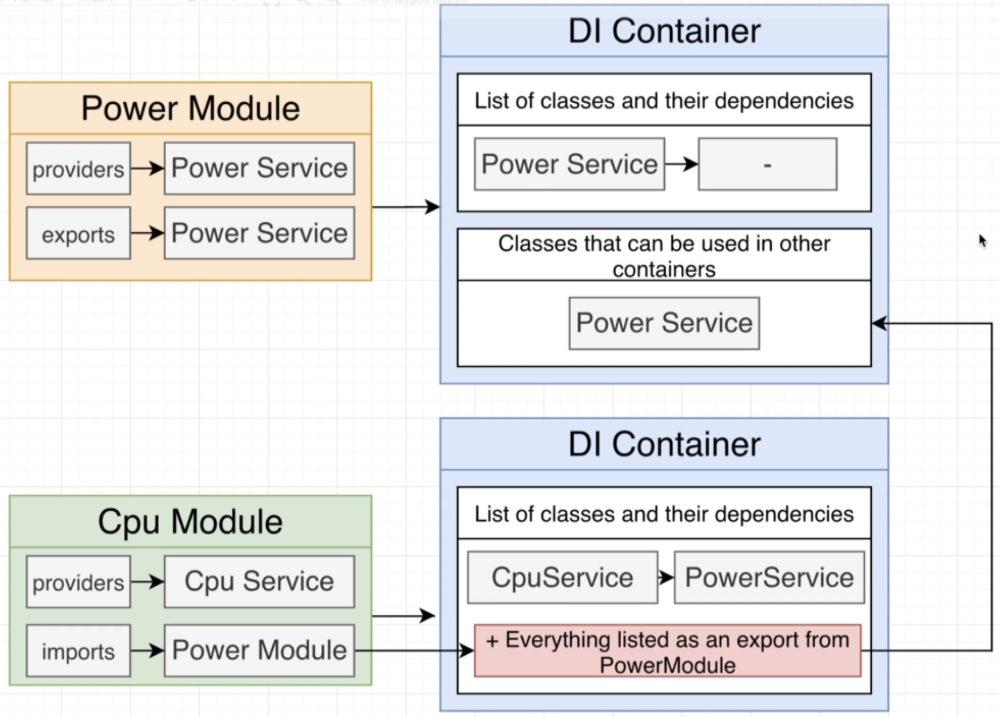

# NestJS | 10

### Bootcamp

[Discord](https://discord.gg/URhAqbTEJb) | [Official Documentation](https://docs.nestjs.com/)

[Kushagra Acharya](https://www.linkedin.com/in/kushagraacharya/)

---

## Disclaimer

- This is an optional course and will not effect your academic credit
- If you're not interested and cannot fullfill any requirement or class rules you will be resulted for class dropout.

---

## General Rules

- Having a laptop and a separate notebook is compulsory
- Faliure to answer at least 3 viva question will result in dissmissal.
- Faliure to complete homework/classwork without any valid result will be unacceptable.

---

## Prerequisite

- Separate notebook/copy for notes
- NVM with Node Installed
- PC with VS Code Installed
- Stable Internet Connection

---

## Module Architecture

---

## About

- In this project we will try to imitate how computer work
  

---

## Overview of Project


---

## Modules DI

- We will create modules as discussed previously
- Power Module
- CPU Module
  - Will need Power Module
- Disk Module
  - Will need Power Module
- Computer Module
  - Will need CPU and Disk Module

---

## Create new Project

```bash
 nest new di
```

- delete all except `main.ts`

```
nest g module computer
```

```
nest g module cpu
```

```
nest g module disk
```

```
nest g module power
```

---

## Generate Services

```
nest g service cpu
```

```
nest g service power
```

```
nest g service disk
```

---

## Generate Controller

```
nest g controller computer
```

---

## AppModule

- in `main.ts`
- import and use `ComputerModule`

---

## Approach

- So we start usually from the module which does not depend on any other module, which in our case is the `PowerModule` where we need the `PowerService`

- inside `power.service.ts` make function as

```ts
supplyPower(watts:number){
  console.log(`Supplying ${watts} of power`);
}
```

---

## Sharing Services

- So in the figure about our project we see that `PowerService` is shared by `CPU Service` and `Disk Service` from two different modules
- This is new to us!
- CPU services needs instance of Powerservice and same for the Disk Service

---

## Sharing Services


---

## Sharing Service

- We already have done/know how to share services within the same module from our previous classes.

  To inject serviceA inside serviceB we do:

1. make @injectable for ServiceA
2. add ServiceA to ModuleA's list of providers
3. define ServiceA object in ServiceB's constructor

---

## Sharing outside Module


---

## Sharing outside Module (1)

- in `power.module.ts`
- there is already `providers`
- here the `PowerService` in providers list can be accessed by only this module
- which is private nature by default
- to make it accessible from other module we add a new property to @module

```ts
exports: [PowerService];
```

---

## Sharing outside Module (2)

- in `cpu.module.ts`
- import the `PowerModule` which has the exported `PowerService`

```ts
imports: [PowerModule];
```

---

## Sharing outside Module (3)

- in `cpu.service.ts`
- define the constructor and add `PowerService` dependency to it

```ts
constructor(private powerService:PowerService){

}
compute(a:number, b:number){
 console.log('Drawing 10 watts of power from power service);
 this.powerService.supplyPower(10);
 return a+b;
}
```

---

## Disk Service

- Analyse the process for DiskModule and complete until you navigate to `disk.service.ts`

```ts
getData(){
  console.log('Drawing 20 watts of power from power service);
  this.powerService.supplyPower(20);
  return 'data';
}
```

---

## Consuming Multiple Module

- For the last step, out `Computer Module` should consume CPU and Disk Module
- Now lets export CPU and Disk Services in their respective @Module
- in `disk.service.ts`

```ts
@Module([
  exports: [DiskService]
])
```

> do same for `CPUService`

---

## Computer Module

- now we import 2 modules to the computer module as

```ts
@Module([
  imports: [CpuModule,DiskModule],
  controller: [ComputerController]
])
```

---

## Create the Computer Controller Function

- create constructor which will have `cpuService` and `diskService`

- make a @Get method run() as

```ts
run(){
 return [
   this.cpuService.compute(1,2);
   this.diskService.getData();
 ]
}
```

- save all and start project
  > npm run start:dev

---

## Test

- Make GET request from postman
- You should get

```json
[3, "data!"]
```

- which is the result of 2 services CPU and Disk

---

## Conclusion



---

## End

- You will have to do a project for next class and then we will start database!
