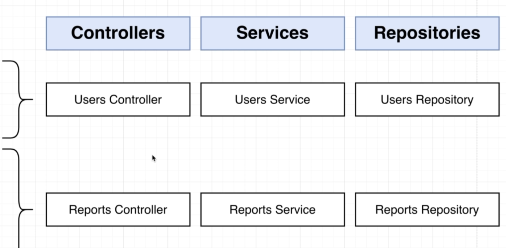

# NestJS | 11

### Bootcamp

[Discord](https://discord.gg/URhAqbTEJb) | [Official Documentation](https://docs.nestjs.com/)

[Kushagra Acharya](https://www.linkedin.com/in/kushagraacharya/)

---

## Disclaimer

- This is an optional course and will not effect your academic credit
- If you're not interested and cannot fullfill any requirement or class rules you will be resulted for class dropout.

---

## General Rules

- Having a laptop and a separate notebook is compulsory
- Faliure to answer at least 3 viva question will result in dissmissal.
- Faliure to complete homework/classwork without any valid result will be unacceptable.

---

## Prerequisite

- Separate notebook/copy for notes
- NVM with Node Installed
- PC with VS Code Installed
- Stable Internet Connection

---

## Project Time!

---

## About

- We are going make API for an app : Used Car Pricing API

---

## Overview of Project


---

## Start

- generate new nest project called 'mycv' as MyCarValue

---

## Routes Discussion


---

## File Structure



---

## Separting Module


---

## Making Modules

- Since in this project we will be using database, lets not create the repo at first
- We will leave it for later

- Open terminal and make modules

```bash
nest g module users
```

```bash
nest g module reports
```

---

## Create Controllers

```bash
nest g controller users
```

```bash
nest g controller reports
```

---

## Create Services

```bash
nest g service users
```

```bash
nest g service reports
```

---

## Check your files

- see if all modules, service, controllers are created or not

- see `app.module` and check @Module configurations like imports,controllers,providers

- check if everything works

- you dont have to delete anything (not yet)

---

## Next

- Diving into Database!
