# NestJS | 12

### Bootcamp

[Discord](https://discord.gg/URhAqbTEJb) | [Official Documentation](https://docs.nestjs.com/)

[Kushagra Acharya](https://www.linkedin.com/in/kushagraacharya/)

---

## Disclaimer

- This is an optional course and will not effect your academic credit
- If you're not interested and cannot fullfill any requirement or class rules you will be resulted for class dropout.

---

## General Rules

- Having a laptop and a separate notebook is compulsory
- Faliure to answer at least 3 viva question will result in dissmissal.
- Faliure to complete homework/classwork without any valid result will be unacceptable.

---

## Prerequisite

- Separate notebook/copy for notes
- NVM with Node Installed
- PC with VS Code Installed
- Stable Internet Connection

---

## Project Time! Databases

---

## About

- We learn about database setup in nest from scratch

---

## Types of DB

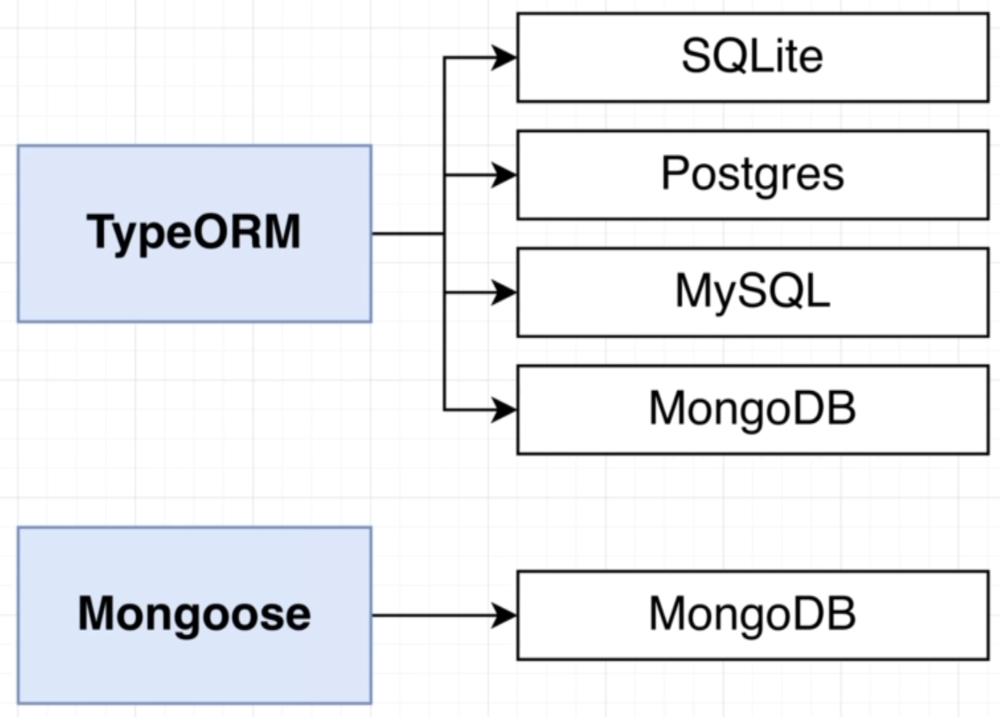

---

## Library

- TypeORM interfaces easily with various types of databases easily

- Mongoose is noSql db which is easily used in NestJs

---

## TypeORM

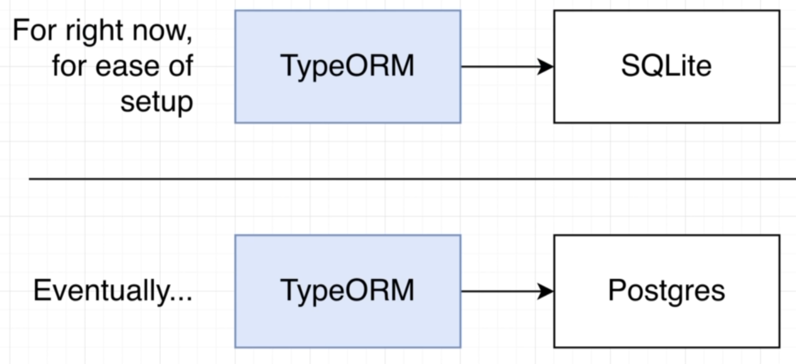

---

## Installing libraries for DB

```bash
npm i @nestjs/typeorm typeorm sqlite3
```

- typeorm library
- @nestjs/typeorm - makes typeorm work with nestjs
- db as sqlite3

---

## Application Diagram

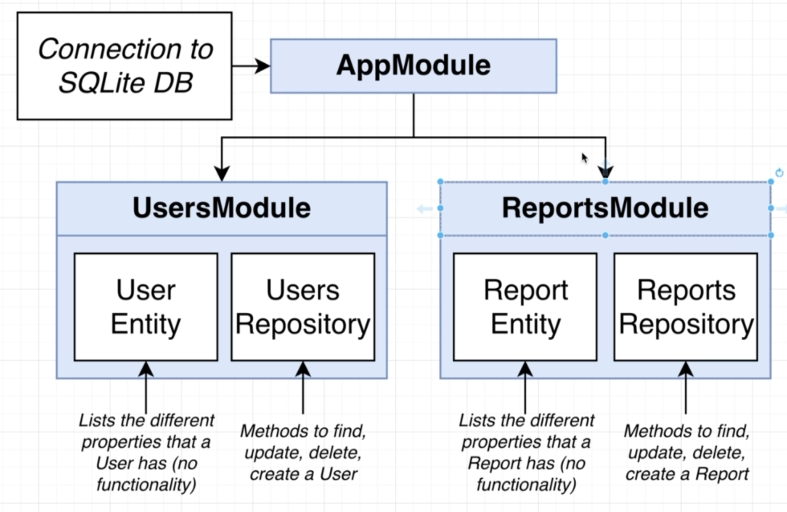

---

## Explanation

- AppModule is the main module which holds other 2 module
- DB Connection is done to AppModule which can shared to other modules automatically
- In both user and report modules there are Entity files, which is similar to dto or model
- Repostory files are not created as we did for json files because we are using db this time

---

## Create Connection

- in `app.moddule.ts`
- import `TypeOrmModule` from @nestjs/typeorm;

```ts
imports: [
  TypeOrmModule.forRoot({
    type: "sqlite", //type of db
    database: "db.sqlite", //name of db
    entities: [], //list of entities,
    synchorize: true,
  }),
  UsersModule,
  ReportsModule,
];
```

- this sets the connection to sqlite database, the forRoot will share this to whole project so other modules can use it

---

## ESLit (Optional)

- disable eslint as `.eslintrc.js`

```bash
 module.exports = {}
```

---

## Start the app from terminal

- run the app
- notice the `db.sqlite` file in root
- you can see raw db data in this file which will be encoded

---

## Diagram

- See diagram about the application
- We just setup connection
- We now create entity file and use it
- TypeOrm and Nest will automatically create repositry for these entities using the database!

---

## Create Entity

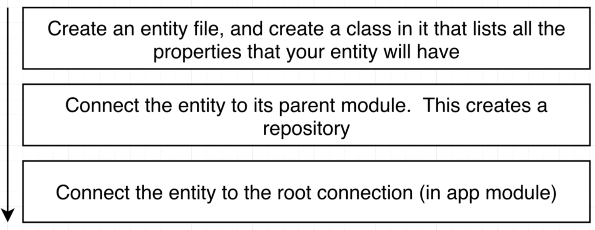

---

## Create Entity (1)

- in `user` folder create `user.entity.ts`
- import {Entity, Column, PrimaryGeneratedColumn} from 'typeorm' package
- these 3 are the decorators which we have imported from typeorm

then we create a class

> we are calling it User not UserEntity

```ts
export class User {
  //list the props of user which we expect
  id: number;
  email: string;
  password: string;
}
```

---

## Decorate

```ts
@Entity()
export class User {
  @PrimaryGeneratedColumn()
  id: number;
  @Column()
  email: string;
  @Column()
  password: string;
}
```

---

## Connect to Parent Module (2)

- in `user.module.ts`

```ts
@Module({
    imports: [
        TypeOrmModule.forFeature([User])
    ]
})
```

- this step creates the repository of user for us

---

## Connect Entity to Root Module (3)

- in `app.module.ts`

```ts
entites: [User];
```

- this connects User entity to app module

---

## Steps explained

- in `1` we made an entity that represented the user data and called in entity, it also had some decorators to let the db know the properties

- in `2` we connect the `user entity` to the `user module` which in theory will create the `user repository` (figure)

- in `3` we connect the `user entity` to `app module` which helps in root connection

---

## Start

- stop the project and start again, there should be no error

- this should have created the `UserRepository`

---

## Report Entity

- same steps as User Entity steps 1,2,3
- make entity file

```ts
@Entity()
export class Report {
  @PrimaryGeneratedColumn()
  id: number;
  @Column()
  price: number;
}
```

- perform steps 2 and 3 as required and re-run the project

---

## Extension

- for `db.sqlite` install extension `sqlite` by _alexcvzz_ from vscode
- use this extension by Ctrl + Shift + P
- should see SQLite Explorer in VSCode Left Panel

---

## What we did till now

- in app module we setup typeOrm with sqlite database
- we made `entities` with `decorator` which help us define structure of a `module` data type
- we specified entites here which are needed to make `repository`
- we gave sync as true, so what is that?
- lets understand what is migration in db!

---

## Migration

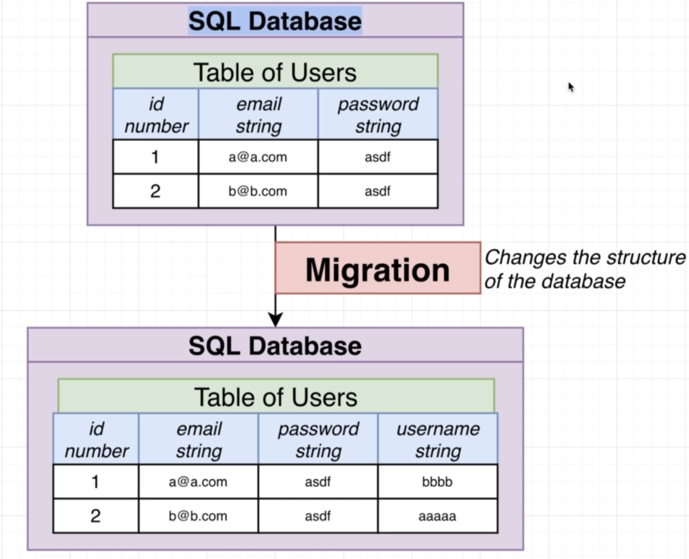

---

## Migration

- a table has `same` data strucutre wheather we add or remote data
- but if we want to `change`(add/remove) any columns we have to do migration
- it is a piece of code which will change the structure of our table : `migration`
- the image above migrates table by adding a new column of `username` as `string`

---

## Migration

- in our project we have not done any migration
- not even created any manual databases
- this `synchronize` is always used in development environment
- this looks into our entities and create `tables` as required
- this is the feature of typeOrm which is called `synchronized` feature which works when it is set to true which means it also handles migrations

---

## How TypeOrm builds table by decorator

- **@Entity** helps tOrm to create a table in sqlite db called what the class name is but in plural

- **@PrimaryGeneratedColumn** will generate a column will server as id and is always automatically generated as a number while adding a row

- **@Column** decorator will create a column with given type

This is how typeOrm makes the table while looking into the repo

---

## Diagram (typeOrm)

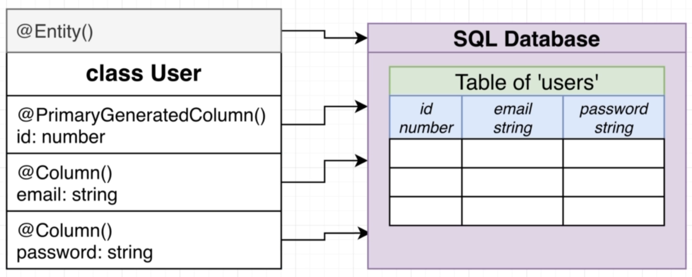

---

## Sync

- if we add any additional props to User entity, the `synchronize` will update the table, and do the migration automatically!
- which is very helpful
- if we did not use the typeOrm, we should write migration manually

---

## Repository

- remember the figure of Application Diagram?
- look at it and you'll see Repository
- which we have not created
- as it is easily handled by typeOrm by using the entity we created a while ago

- UserRepositry and ReportRepository is available and we are using this using the dependency injection technique we learned in last class

---

## Overview of Repo

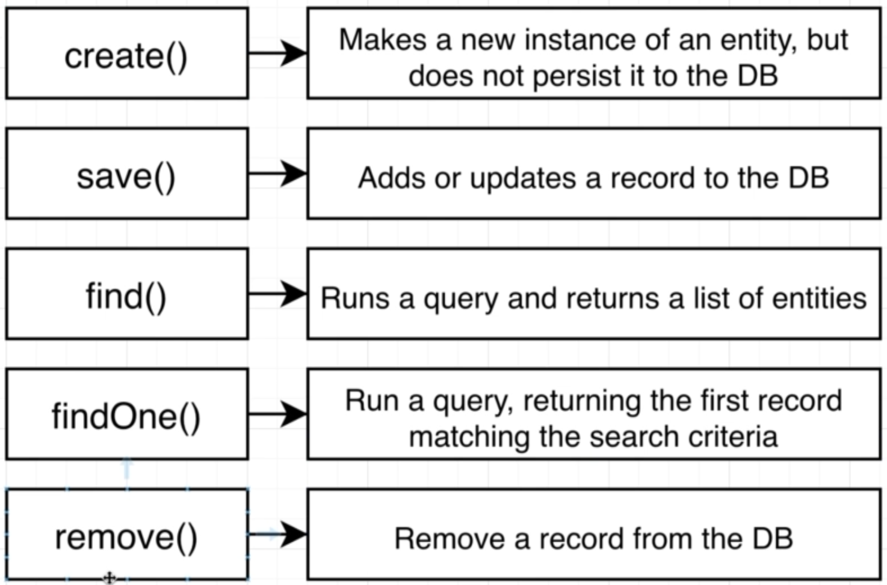

---

## Repository

- you just saw a set of methods provided by repo
- this methods helps to manipulate data of `entity` in `database`
- as we know these functions belong to the repo class and all are generated by the typeOrm

---

## Confusing Methods

- in typescript, javascript or any other thing you might be learning, there will always be another(many) way to do the same work

- for example if I teach you way1 to make repository in typescript, you might find another way when you read the official documentation

- meaning, there will always be alternate way and its okay, the main goal is to achieve the goal and understand how it was done

---

## Concluding Database Theory

- Now we know what table is and what an entity is
- We know what repo is and what functions it has
- We also know what migration is
- We know what the use of typeOrm is

- Let's start with services now

---

## User Services

- the service is going to use UserRepository
- now let's disucss the routes
- yellow boxed routes are just for your practice and are not fully needed in the project

---

## Routes

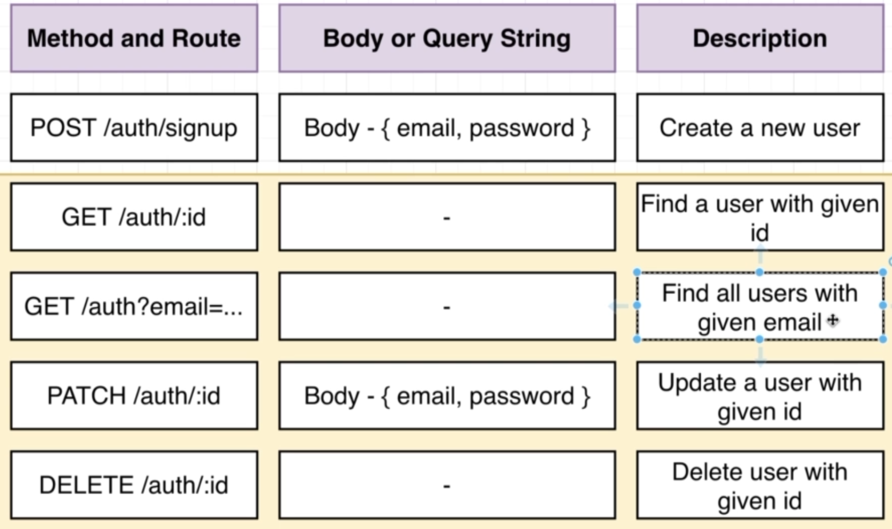

---

## User Controller

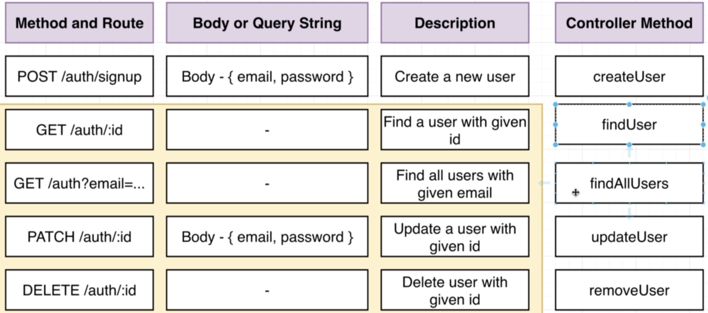

---

## User Service

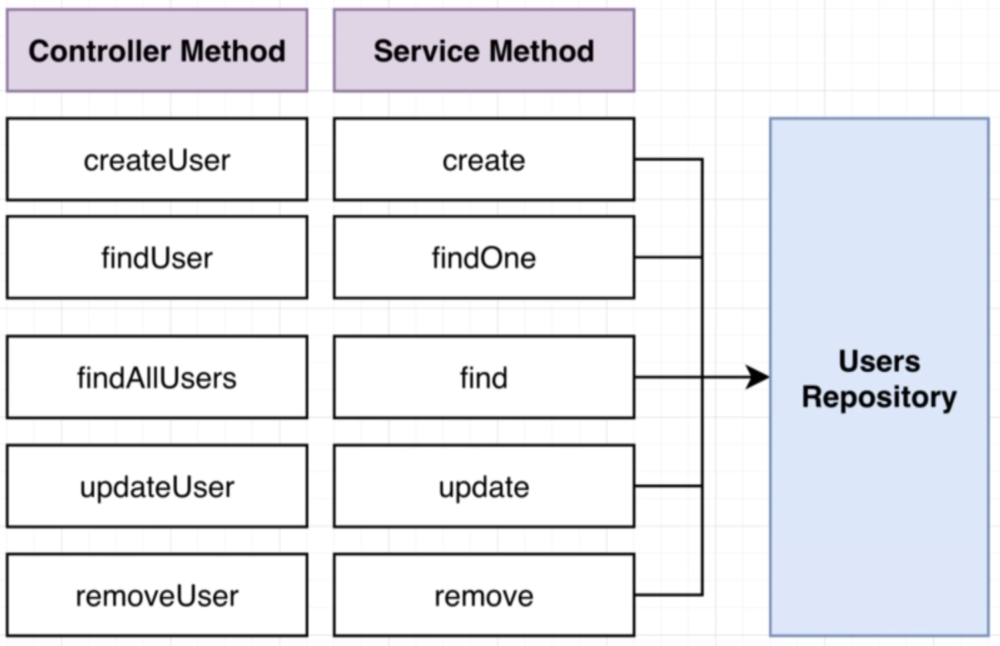

---

## Coding

- enable the global pipe use in main.ts
- in user.controller create a methods to create a new user and decorate it with `@Post` for path `signup`
- now make a dto `create-user.dto.ts` and use pipes for validating the body

> PS: remember to install `class-validator` and `class-transformer`

---

## DTO

```ts
export class CreateUserDto {
  @IsEmail()
  email: string;
  @IsString()
  password: string;
}
```

---

## Controller

- add the dto as @Body in the createUser() method
- console.log that body value to see what are you getting from the postman

```ts
@Post('signup')
createUser(@Body() body: CreateUserDto){
  console.log(body);
}
```

---

## Quick info

the `whitelist: true` parameter used while applying global pipes in main.ts is done to

- ignore any other variables send from postman which is not asked in the dto
- like if you send, age:17 in the postman for `signup`, it is still a valid json
- but as our dto dont have age variable, it is stripped out by `whitelist` property

---

## Creating Service

- `import {Repository} from 'typeorm';`
- inject repository object in the service constructor
- give generic of `Repository<User>` as User in the constructor
- make the injected object `private`
- before the `private` add `@InjectRepository(User)`

---

## Code

```ts
consturctor(
  @InjectRepository(User) private repo: Repository<User>
){

}
```

---

## Using Repo's Create and Save methods

```ts
consturctor(
  @InjectRepository(User) private repo: Repository<User>
){

  //create method
  create(email:string, password:string){
    //creates a user instance using incoming values
    const user = this.repo.create({email,password});
    //saves that user to db
    return this.repo.save(user);
  }

}
```

---

## Doing DI of the service in controller

- now inject the UserService in the UserContoller and use the method create() from the service to controller

---

### Code

```ts
constructor(private userService:UserService){

}

@Post('/signup)
createuser(@Body() body:CreateUserDto){
  this.userService.create(body.email, body.password);
}
```

- test this via postman

- see the database if the value is saved

---

## Review

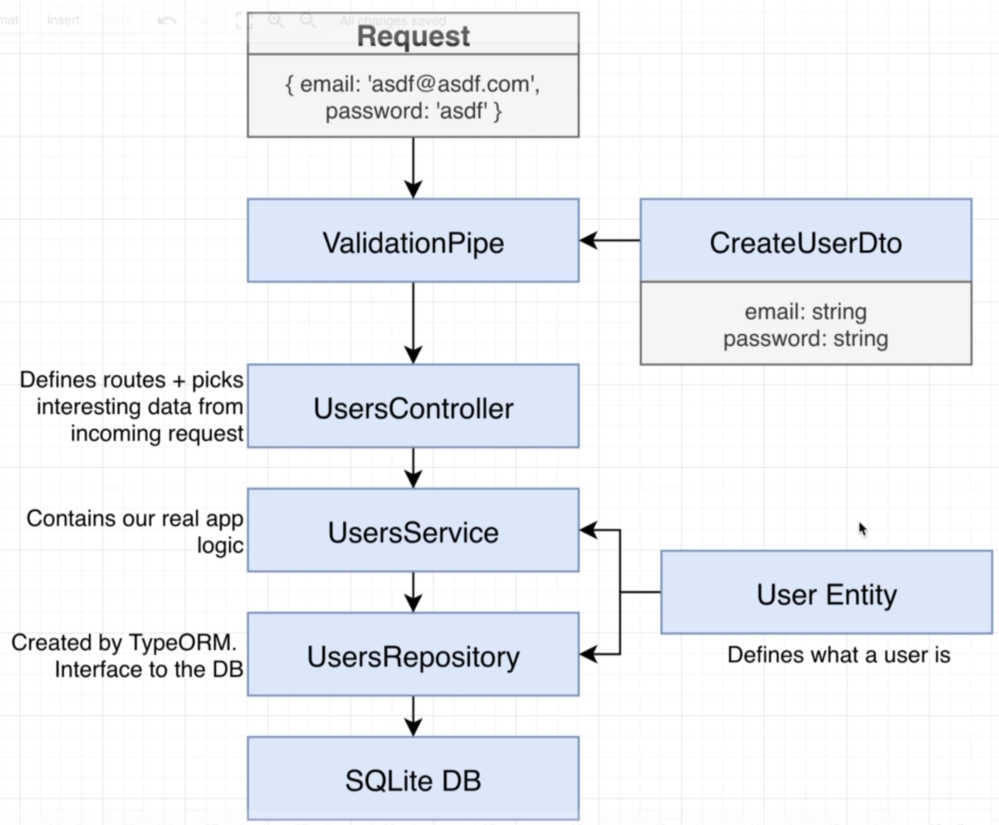
