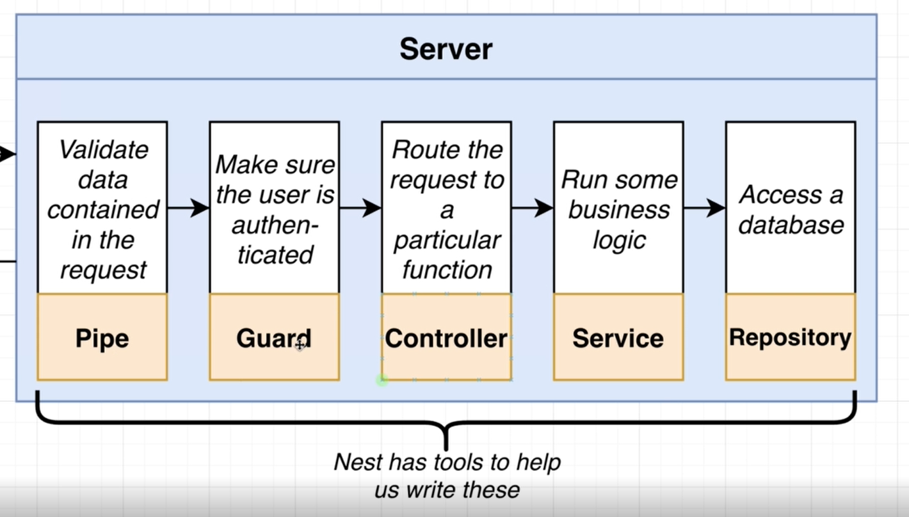
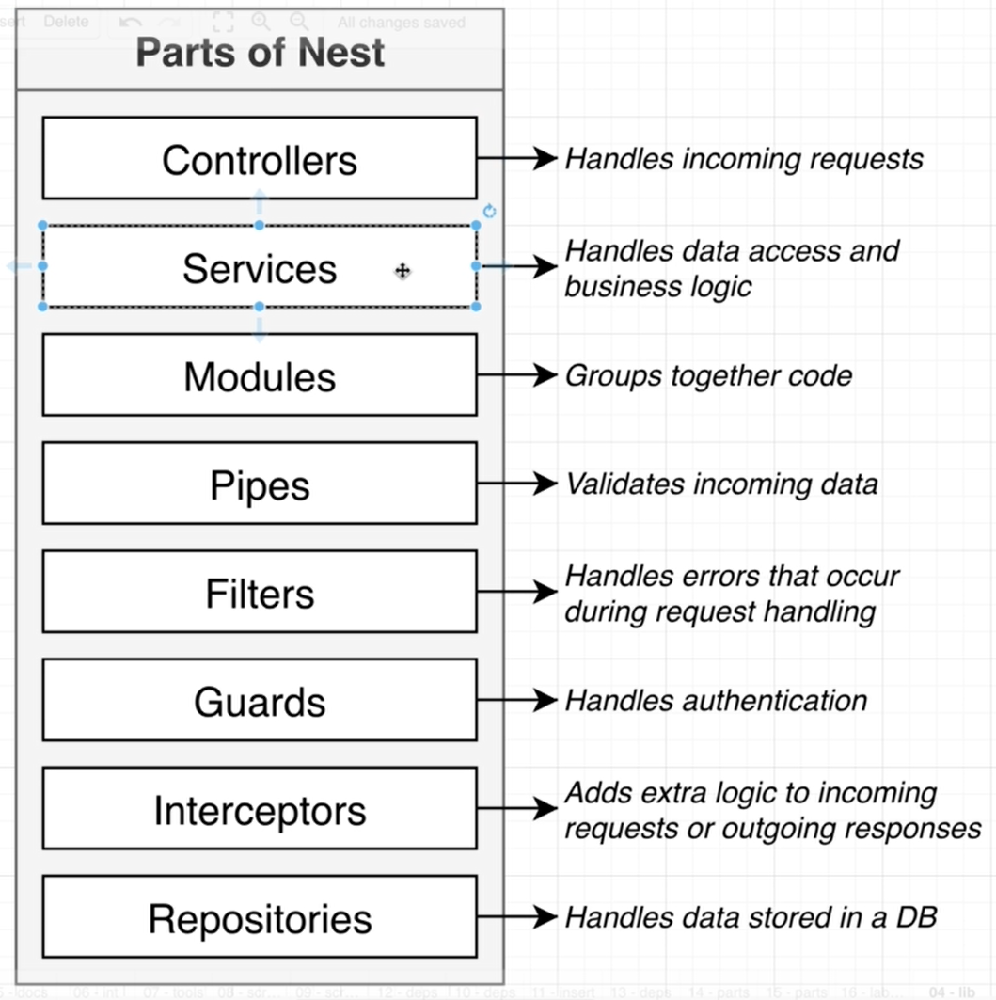

# NestJS | 2

### Bootcamp

[Discord](https://discord.gg/URhAqbTEJb) | [Official Documentation](https://docs.nestjs.com/)

[Kushagra Acharya](https://www.linkedin.com/in/kushagraacharya/)

---

# Disclaimer

- This is an optional course and will not effect your academic credit
- If you're not interested and cannot fullfill any requirement or class rules you will be resulted for class dropout.

---

# General Rules

- Having a laptop and a separate notebook is compulsory
- Faliure to answer at least 3 viva question will result in dissmissal.
- Faliure to complete homework/classwork without any valid result will be unacceptable.

---

# Prerequisite

- Separate notebook/copy for notes
- NVM with Node Installed
- PC with VS Code Installed
- Stable Internet Connection

---

# Project Setup from Scratch

---

## Something from Nothing?

- Will be hard ... very hard .. because we are staring from scratch
- What is scratch?
- We will learn behind-the-scenes stuff
- Know how NestJS works so will make all of Nest easy

---

## Steps

- Open bash
- Go to `D:\backend\nestjs-bootcamp`
- Create a folder called `scratch`
- `cd` into `scratch`
- do `npm init -y` to make `package.json`

---

## Steps

Install the following dependencies from terminal

- `npm install @nestjs/common@9.0.0`
- `npm install @nestjs/core@9.0.0`
- `npm install @nestjs/platform-express@9.0.0`
- `npm install reflect-metadata@0.1.13`
- `npm install typescript@4.7.4`

All are the basic necessary dependencies for NestJS
Open your `scratch` folder in VSCode after installation

---

# package.json

@nestjs/common

> has functions, classes (libs) that we need from Nest

@nestjs/platform-express

> lets Nest use ExpressJs to handle http requests/response

reflect-metadata

> helps make decorators work (more later!)

typescript

> Nest app with typescript

---

# Configure TypeScript

- create file `tsconfig.json` in root
- write the following

```json
{
  "compilerOptions": {
    "module": "commonjs",
    "target": "es2017",
    "experimentalDecorators": true,
    "emitDecoratorMetadata": true
  }
}
```

---

# Nest Module and Controller

---

## Basic Concept of Server


---

## Detail Concept of Server


---

## Nest has special tools for each steps



We will learn each tools in this series

---

## Parts of Nest



---

# Basic Nest App

- to exist as an app
- a simple nest app will contain
  - a controller
  - a module
- which is the minimum criteria for it's existance

---

# Creating the basics of Nest

- in your scratch folder, make `main.ts` file
- main.ts is the 1st file to get executed in any Nest project
- Complete the following code in `main.ts`

```ts
import {Controller, Module} from '@nestjs/common`
```

- these tools provided by nest for us to create our own controllers and modules

---

# Creating a controller

- below import, write

```ts
class AppController {}
```

- decorate the `AppController` with `@Controller()`

---

# What did we do?

```ts
@Controller()
class AppController {}
```

- We made own own controller using a decorator which tells nest that AppController is a controller
- Controller is made to handle and route incoming request
- Inside controller we will creating functions that will be able to handle specific requests

---

# Task!

- Delete this `main.ts` file
- Make a new `main.ts` and do creation of a controller

---

# Method Route in Controller

- import `Get` decorator and use for `getRootRoute`
- Add a method with following content

```ts
import { Controller, Module, Get } from "@nestjs/common";

@Controller()
class AppController {
  @Get()
  getRootRoute() {
    return "Hello Root Route!";
  }
}
```

---

# Now Module

- Module is going to `wrap-up` a controller
- Every app we create must have at least one module
- Create a module below the previous `controller`

---

# Create Module

- create a class `AppModule`
- decorate it with `@Module()`
- Try it yourself!

---

# Passing configuration object to Module

- There is error in Module decorator
- It needs configuration as

```ts
@Module({
  controllers: [AppController],
})
class AppModule {}
```

- controllers property will list all controllers in the application

---

# What will happen?

Whenever our nest app starts

- It will look into this `AppModule`
- It will find all the `Controllers` listed in `Module`
- Automatically creates instances of all controller classes
- So `AppController` instance will be created
- Will check all the decorators, eg: `@Get()`, and define `route handlers`

---

# Review

## What we did :

- main.ts as entry point
- Nest needs Module and Controller so we made both in main.ts
- `Module` wraps `Controller`
- `Controller` wraps `routes` with `methods` like `@Get()`
- Module needs `configuration`

---

# Bootstrap

- main entrypoint needs a function
- async function called bootstrap()

```ts

    import {NestFactory} from '@nestjs/core

    async function bootstrap(){
        const app = await NestFactory.create(AppModule);
        await app.listen(3000);
    }

    bootstrap();
```

---

# Run Application

Terminal

- make sure you're inside the project in cmd
- `npx ts-node-dev src/main.ts`
- will run the app
- "Nest Application Successfully Started"
- other program using port 3000?
- now see `localhost:3000`

---

# Congratulations

You've completed:

- Core understanding of Nest and its components
- Module and Controller concept and creation
- main.ts file structure and use

---

# Homework

- create a Nest project from scratch where:
  - in main.ts there is a module
  - module will have `Hello EEC Student`
  - submit the code via github from your account in discord

## Viva questions:

- Module and Controller
