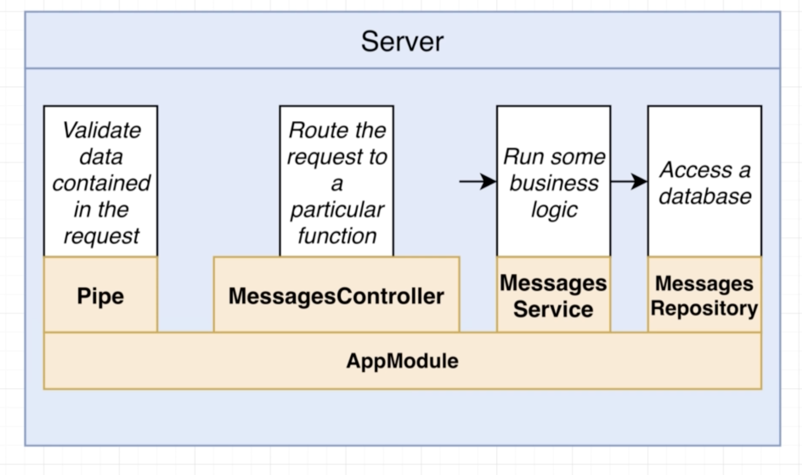

# NestJS | 5

### Bootcamp

[Discord](https://discord.gg/URhAqbTEJb) | [Official Documentation](https://docs.nestjs.com/)

[Kushagra Acharya](https://www.linkedin.com/in/kushagraacharya/)

---

## Disclaimer

- This is an optional course and will not effect your academic credit
- If you're not interested and cannot fullfill any requirement or class rules you will be resulted for class dropout.

---

## General Rules

- Having a laptop and a separate notebook is compulsory
- Faliure to answer at least 3 viva question will result in dissmissal.
- Faliure to complete homework/classwork without any valid result will be unacceptable.

---

## Prerequisite

- Separate notebook/copy for notes
- NVM with Node Installed
- PC with VS Code Installed
- Stable Internet Connection

---

## Messages App

---

## Previously

- We learned that without the help of CLI we can make basic Nest project
- CLI gave us a lot of files and packages which are not mandatory
- With very less files and libraries we can build a simple API system
- This gave us the basic idea of working of Nest

---

## New Project

- close the vscode
- close any terminals
- open your `workspace` folder and create `nest-backend`
- open terminal inside `nest-backend`
- perform `nest new messages` to create new project
- `cd messages` and `code .` to open it in new vscode

---

## Messages

- Simple Nest app
- Store and Retrieve messages stored in a plain JSON file

---

## Overview

- We will have 3 routes
  - list all message
  - list message by id
  - create message

---

## Retrieve message list

- Concept of getting all messages in a list
- GET request `localhost:3000/messages`
- Will not have
  - **Pipe** : as there is not request validation
  - **Guard** : as there is no auth system in project
- Will have
  - **Controller** : to route the request to a function
  - **Service** : logic to access JSON and get message
  - **Repository** : treat JSON file as database (make-do)

---

## Receive message list (diagram)

---

## Send single message (diagram)

---

## Receive single message with id (diagram)

---

## Overview

- So we are making `Controller` to handle messages routing
- `Service` for logics of accessing and managing data
- `Repository` for data storage
- But all these files we are going to create is inside a `Module`
- A module should contain only similar types or relatable files
- As a result the module we are working on will have only `message` related files

---

## Overview (diagram)

---

## Open project in VSCode

- Compared to `scratch` project there are a lot of files due to project generation from CLI
- See `scripts` in `package.json` where `"start:dev"` is very important now to run the server in development mode
- Try in terminal: `npm run start:dev` inside the message project

---

## eslint

- by default Nest makes use of `eslint`
- see file `.eslintrc.js`
- eslint is a command-line tool which highlights possible erros, formatting error in your project
- eslint can be disabled for the project by commenting the whole object inside module.exports
- this is sometimes done if you have a better error highlighting tool than eslint and is purely dependent on personal preference
- this is an optional process.
- for me I am going to disable eslint, you can skip it.

---

# Discussion

- GET
- POST
- GET by ID

---

# Congratulations

## Level Completed!

- Planning for API development with files needed
