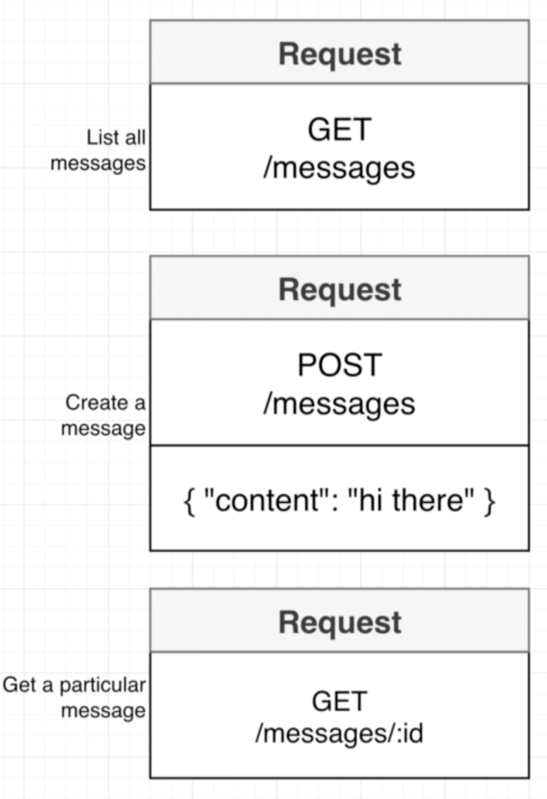
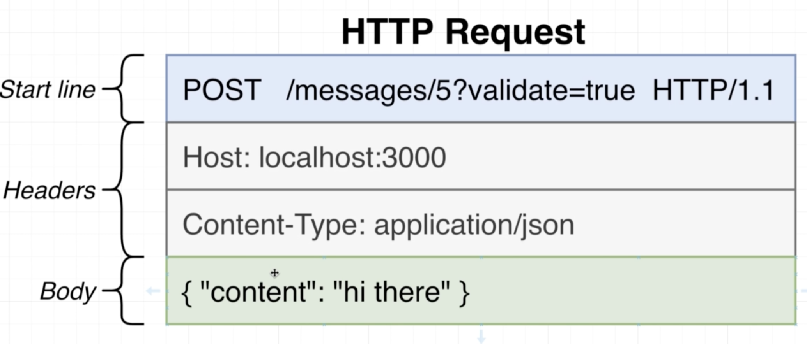
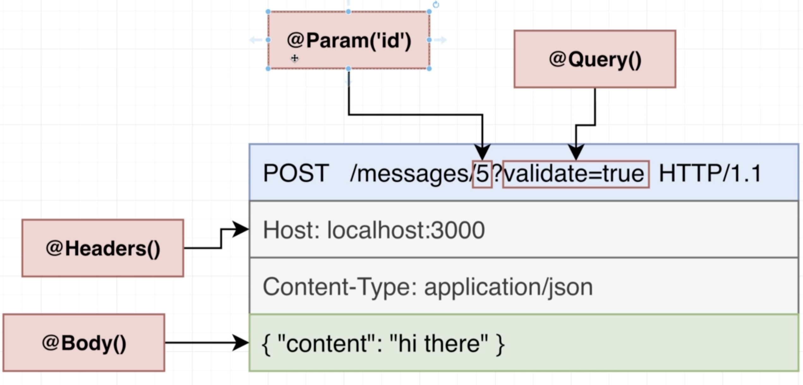

# NestJS | 6

### Bootcamp

[Discord](https://discord.gg/URhAqbTEJb) | [Official Documentation](https://docs.nestjs.com/)

[Kushagra Acharya](https://www.linkedin.com/in/kushagraacharya/)

---

## Disclaimer

- This is an optional course and will not effect your academic credit
- If you're not interested and cannot fullfill any requirement or class rules you will be resulted for class dropout.

---

## General Rules

- Having a laptop and a separate notebook is compulsory
- Faliure to answer at least 3 viva question will result in dissmissal.
- Faliure to complete homework/classwork without any valid result will be unacceptable.

---

## Prerequisite

- Separate notebook/copy for notes
- NVM with Node Installed
- PC with VS Code Installed
- Stable Internet Connection

---

## Messages Project Part 2

---

## Previously

- We learned that what are the types of ROUTES we are going to make
- What is GET and GET with id
- What is POST
- Project setup from CLI

---

## To Run Project

- `script` in `package.json`
- `start:dev` to start the project in development mode
- Make change to project and save to see changes
- Try this yourself

---

## Inside `src` folder

- CLI gives us generated files which is ready to run
- You are already familiar with
  - `app.contorller.ts`
  - `app.module.ts`
- There maybe some extra codes & files in these files which we will discuss gradually
- So for the sake of learning perfectly please delete all files inside `src` except `main.ts`
- Notice there is import error `main.ts` which is prefectly fine to have.

---

## Overview Revision

- All sub-components falls under MessagMeodule
  

---

## Generating Files for MessageModule

- To Generate Module, from terminal

```
 > nest generate module messages
```

- A file has been created as `src/messages/messages.module.ts`
- in `main.ts` hook your NestFactory with `MessageModule` by replacing `AppModule`

---

## Generating Controller

```
nest generate controller messages/messages --flat
```

- See that 2 files are created and 1 file is updated
- Let's see what the CLI actually did

---

## CLI action breakdown


---

## Adding Routes to Controller

- Add route handlers inside the class MessageControllers
- We have 3 routes
  - get all messages
  - get single message by id
  - post single message

---

## Routes Revision



---

## Task : Create routes

### Option 1 : Route names for endpoints

- `@Get('messages')` for `listMessages()`
- `@Post('messages')` for `createMessage()`
- `@Get('messages/:id')` for `getMessages()`

> Create routes yourself

---

## Task : Create routes

### Option 2 : Repeting route can be promoted to controller

- `@Controller('messages')`
- `@Get()` for `listMessages()`
- `@Post()` for `createMessage()`
- `@Get('/:id')` for `getMessages()`

> We are going to follow option 2

---

## Task : Create routes

- Create the routes needed yourself

---

## Solution

- `message.controller.ts`
- First import the `Get` and `Post` from `@nestjs/common`

```js
import { Controller, Get, Post } from "@nestjs/common";
```

---

## Solution

- Then create functions inside the controller as

```ts
@Controller("messages")
export class MessagesController {
  @Get()
  listMessages() {}

  @Post()
  createMessage() {}

  @Get("/:id")
  getMessage() {}
}
```

---

## Handling Requests

- As we have `Post` request, we need to learn how to handle body of the incoming request in` createMessage()`

- For `Get` with `wildcard` (:id) value we need to learn how to handle the `id` value in the incoming request in `getMessage()`

---

## HTTP Request Structure



---

## Extracting important parts of Request



---

## Using Argument Decorators

For body

```ts
@Post()
createMessage(@Body() body:any){
  console.log(body);
}
```

For Wildcard

```ts
@Get('/:id)
getMessage(@Param('id') id:string){
  console.log(id);
}
```

---

## Final Look

```ts
@Get
listMessages(){}
```

```ts
@Post()
createMessage(@Body() body:any){
  console.log(body);
}
```

```ts
@Get('/:id){
  getMessage(@Param('id) id:string){
    console.log(id);
  }
}
```

## Next Class

- Validation and Pipes
