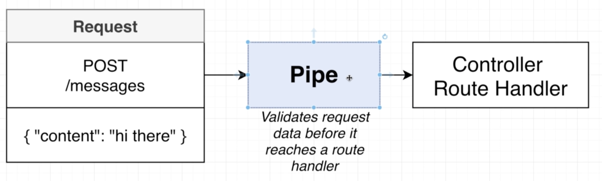
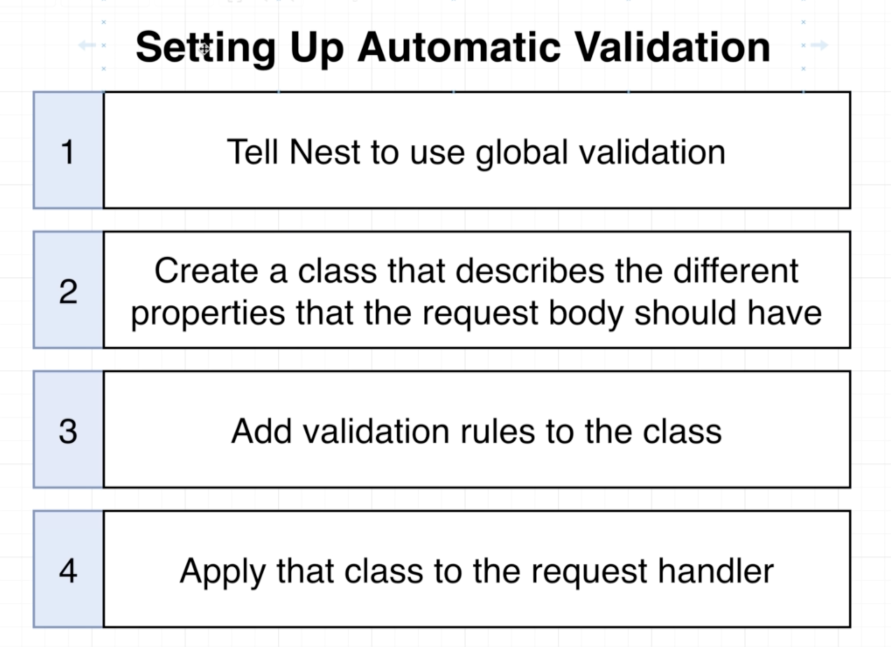
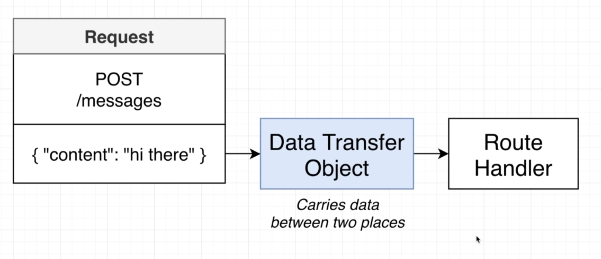
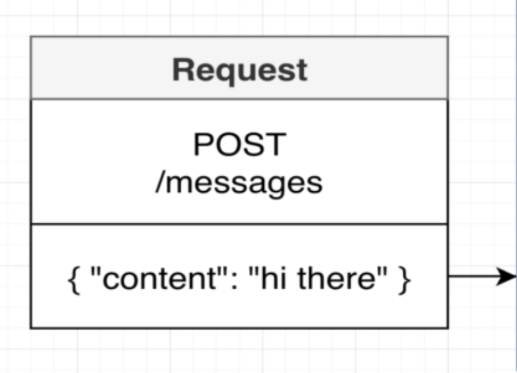
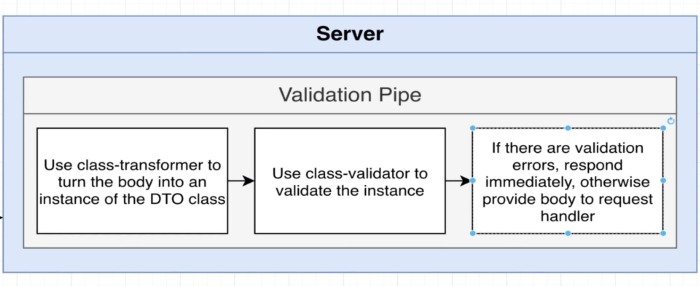

# NestJS | 7

### Bootcamp

[Discord](https://discord.gg/URhAqbTEJb) | [Official Documentation](https://docs.nestjs.com/)

[Kushagra Acharya](https://www.linkedin.com/in/kushagraacharya/)

---

## Disclaimer

- This is an optional course and will not effect your academic credit
- If you're not interested and cannot fullfill any requirement or class rules you will be resulted for class dropout.

---

## General Rules

- Having a laptop and a separate notebook is compulsory
- Faliure to answer at least 3 viva question will result in dissmissal.
- Faliure to complete homework/classwork without any valid result will be unacceptable.

---

## Prerequisite

- Separate notebook/copy for notes
- NVM with Node Installed
- PC with VS Code Installed
- Stable Internet Connection

---

## Messages Project Part 3

---

## Previously

- We learned about decorators for controllers and API methods
- How to write functions in controllers
- How to do @Get and @Post
- Different parts of HTTP Request

---

## Validation

- For the @Post method we have we know that it has a @Body
- This body is used to send data from user side to server side
- @Get methods dont have body
- To write a better @Post method, we should be able to do validation

---

## Validation

- Validation of the incoming body
- Should check if the body is empty?
- Should check if the body is string but int is passed?
- PIPES can be used to perform these kind of checks to data
- We can make our own PIPES or use the PIPES give by NestJS itself.

---

### Pipe



---

## Validation Pipe

- Is a type of Pipe given by NestJs
- Built into Nest
- Helps to handle validation of data

---

## Setup Pipe

- Open `main.ts`

```ts
import { ValidationPipe } from "@nestjs/common";
```

- inside ` bootstrap()`` function just  below  `const app` decleration

```ts
app.useGlobalPipes(
  //globally implemented
  new ValidationPipe() //validates all incoming requests
);
```

---

## Setup Automatic Validation



---

## How to Setup

- `Step 1` : Global Validation is done once (done)
- `Step 2,3,4` : Every Single Time When you have to use Pipe on Route Handler

---

## Step 2 : DTO

- Class we are going to create is a `DTO` or `Data Transfer Object` (more on this later)

- inside `src>messages` create folder `dtos` create a file
  - `create-message.dto.ts`
- give class name `CreateMessageDto` and export it
- create a property inside class as `content:string`
- This property is the `@Body` of `@Post createMessage` method
- Compete this!

---

```ts
export class CreateMessageDto {
  content: string;
}
```

---

## Step 3 : Import Validator

- Import {IsString} from 'class-validator';
- You must install `class-validator` from terminal first
- Also install `class-transformer`

```
 > npm i class-validator class-transformer
```

- Start server once again

---

## Step 3: Use validator

```ts
import { IsString } from "class-validator";

export class CreateMessageDto {
  @IsString() //valida tor
  content: string;
}
```

- This make sures that content is actually a string!

---

## Step 4 : Apply Class to Request Handler

- Go to `messages.controller.ts`
- Import `CreateMessageDto`
- Change `body` type from any to `CreateMessageDto` in the @Post method

---

## Step 4 : Example

```ts
...
import {CreateMessageDto} from './dtos/create-message.dto';

@Controller('messages')
export class MessagesController{

@Post()
createMessage(@Body() body: CreateMessageDto){
console.log(body);
}

```

---

## Make Request via Postman

- Send Post request to `http://localhost:3000/messages`

```json
{
  "content": 123
}
```

- See the output

---

## Testing Requests

#### Test 1

```json
{
  "content": "hi there"
}
```

#### Test 2

```json
{
  "content": null
}
```

---

## Testing Requests

#### Test 3

```json
{}
```

#### Test 4

```json
{
  "contentsz": "hi"
}
```

---

## Step 2 : DTOs Explain

- Goal of DTOs is to carry data between two places
- DTO usually dont have any kind of functionalities
- They are just the representation of data

---

## Step 2 : DTOs Explain



---

## Step 3 : Validator Explain

- Validation Rules are the rules that check for data validity
- These rules are `applied` to the DTO
- To do this we installed `class-validator` & `class-transformer`;

---

## Step 3 : Class Transformer [see doc](https://github.com/typestack/class-transformer)

- Even though we did not exclusively use it, this transformer works for us behind in the shadows
- It converts the plain (literal) objects to class (constructor) objects
- Which means it convets `{}` objects to `class` instances objects
- Which means it converts `json` objects to `ES6 classes`
- Previously We converted `{"content":"hi there"}` to object of `class CreateMessageDto` using this package

---

## Step 3 : Class Validator [see doc](https://github.com/typestack/class-validator)

- Handles validatation of property of class using decorators
- See decorators in documentation inside [Validator decorators](https://github.com/typestack/class-validator#validation-decorators)
  - @IsString()
  - @IsInt()
  - @IsPositive()
  - etc.

---

## Working from Request to Pipe

- Request Model



---

## Working from Request to Pipe

- Validation Pipe Handling



---

## Solution

---

## Next

- Services and Repositories
