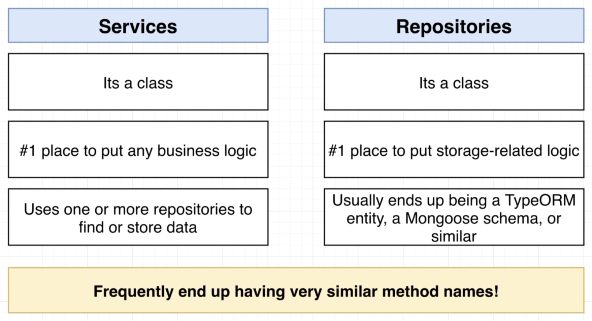
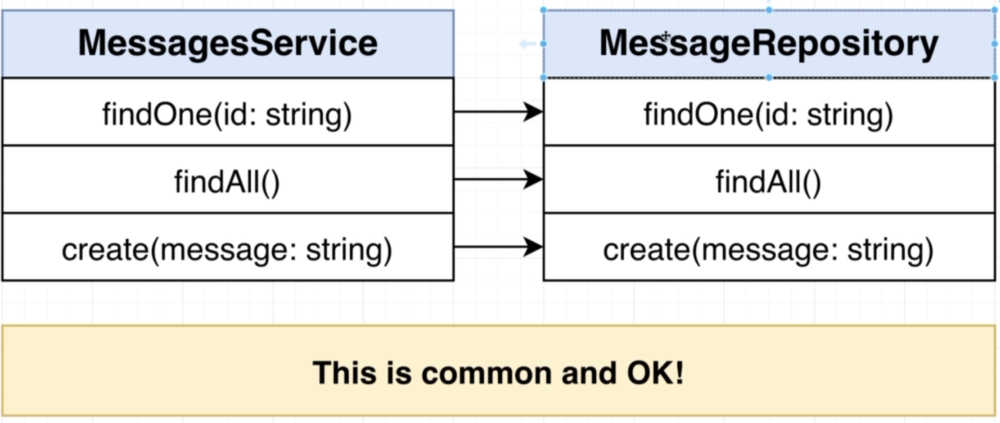

# NestJS | 8

### Bootcamp

[Discord](https://discord.gg/URhAqbTEJb) | [Official Documentation](https://docs.nestjs.com/)

[Kushagra Acharya](https://www.linkedin.com/in/kushagraacharya/)

---

## Disclaimer

- This is an optional course and will not effect your academic credit
- If you're not interested and cannot fullfill any requirement or class rules you will be resulted for class dropout.

---

## General Rules

- Having a laptop and a separate notebook is compulsory
- Faliure to answer at least 3 viva question will result in dissmissal.
- Faliure to complete homework/classwork without any valid result will be unacceptable.

---

## Prerequisite

- Separate notebook/copy for notes
- NVM with Node Installed
- PC with VS Code Installed
- Stable Internet Connection

---

## Messages Project Part 4

---

## Previously

- We learned in detail about validation with pipes
- DTOs and its use

---

## Services and Repositories

- So after Controller we now focus in Service and Repositories

  

---

## Compare : Services and Repositories



---

## Differences

- Business Logic : Calculation logic
- Storage Logic : Read Write Info to File / DB logic

- A `Service` can use multiple repo available to perform its logic

  - Get data from multiple source and perform combination operations

- `Repository` end up as wrapper around a `storage library` like TypeORM, Prisma, Mongoose Schema etc.

---

### Confusion Case



---

## Clearing Confusion

- Repository perform all its function related to storing, creating, reading values from the source/db/file as instructed

- Service peforms the logic behind how the data is combined, requested, listed and much more business logic

> Currently you might think that if the functions of Service are placed inside the Repository itself then we would not need service class and it is very fine to think that way. Later this confusion will be cleared

---

## Creating from Scratch

- src > messages > New Files

  - `messages.service.ts`
  - `messages.repository.ts`

- open the repo file and create the `class MessageRepository`
- export the class

---

## Make Functions for Repository

- inside the class, make async functions as :

  - `findOne(id:string){}`
  - `findAll() {}`
  - `create(message:string){}`

- import helper functions to read/write

```ts
import { readFile, writeFile } from "fs/promises";
```

---

## Create a file to store data

- In project root make a json file called `messages.json` and `messages.sample.json`
- in sample file write following json without comments to remember

```json
{
  "12": {
    //id of the message as key of message object
    "content": "hi there!", // message value
    "id": 12 // the id it belongs to
  },
  "13": {
    //id of the message as key of message object
    "content": "hello world!", // message value
    "id": 13 // the id it belongs to
  }
}
```

---

## Repository `findOne`

- Now we write `findOne` function which will
  - Open the file and read it
  - Read the contents as JSON and parse as readable object
  - Get by id and return

```ts
async findOne(id:string){
  const contents = await readFile('messages.json','utf8');
  const messages = JSON.parse(contents); //our json to message object
  return messages[id];
}
```

---

## Repository `findAll`

- Now we write `findAll` function

```ts
async findAll(){
  const contents = await readFile('messages.json','utf8');
  const messages = JSON.parse(contents); //our json to message object
  return messages; //which returns all messages
}
```

---

## Repository `create`

- Now we write `create` function where
  - open the file and read contents
  - randomly generate id (int) and add message to file as string

```ts
async create(content:string){
  const contents = await readFile('messages.json','utf8');
  const messages = JSON.parse(contents); //our json to message object
  const id = Math.floor(Math.random() * 999); //floor for round to int
  messages[id] = {id,content:content};
  await writeFile('messages.json', JSON.stringigy(messages));
}
```

---

## Repository in Completed

- Now open service file

---

## Service

- create `class MessagesService{}`
- import `MessageRepository` on the top
- make a constructor to initialize the repo

```ts
export class MessageService {
  messageRepo: MessagesRepository;

  constructor() {
    //Service is creating a depedency!
    this.messageRepo = new MessageRepository();
  }
}
```

---

## Dependency? Very Important

- When is a constructor created?
  - When object is initialized!
- When in MessageService's object created?
  - When it's constructor works flawlessly!
- What might stops the constructor to work flawlessly?
  - If MessagesRepository is absent or there is some problem!
- So here a class is creating a dependency inside it's constructor
  - DO NOT DO THIS EVER!

---

## So what is the solution?

- We will fix this LATER with very familiar and popular programming technique known as dependency injection!
- Dependency is a very imporatant topic is any programming practice!
- But not now, lets continue as it is.

---

## Continue MessageService

```ts
...
export class MessageService{
  messageRepo : MessagesRepository;
  constructor(){
    this.messageRepo = new MessagesRepository();
  }

  findOne(id:string){
    return this.messageRepo.findOne(id);
  }
}

```

- do same for find all and create yourself!

---

## Connect Service to Controller

```ts
export class MessageController {
  messageService: MessagesService;

  constructor() {
    //do not do this in real app
    this.messagesService = new MessagesService();
  }

  @Get()
  listMessages() {
    return this.messagesService.findAll();
  }
...
```

---

## Connect Service to Controller (continued)

```ts
...
  @Post()
  createMessage(@Body() body: CreateMessageDto){
    return this.messagesService.create(body.content);
  }

  @Get('/:id')
  getMessage(@param('id') id:string){
    return this.messagesService.findOne(id);
  }
}
```

---

## Check your `message.json`

- Make sure the file is there and has `{}` inside it

---

## Ready to Test

- Restart the server
- Test `GET` for `messages` as findAll
- Test `POST` for `messages` with body as `your_name` as create
- Test `GET` for `messages/<id>` as findOne

> id is randomly generated so please recheck your `message.json`

---

## Next

- Error handling, 404
