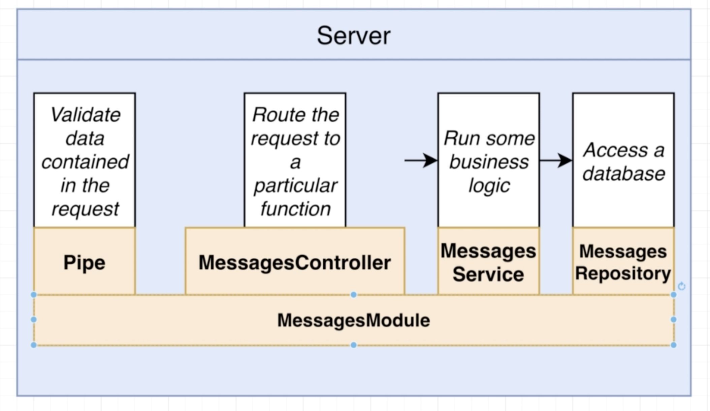
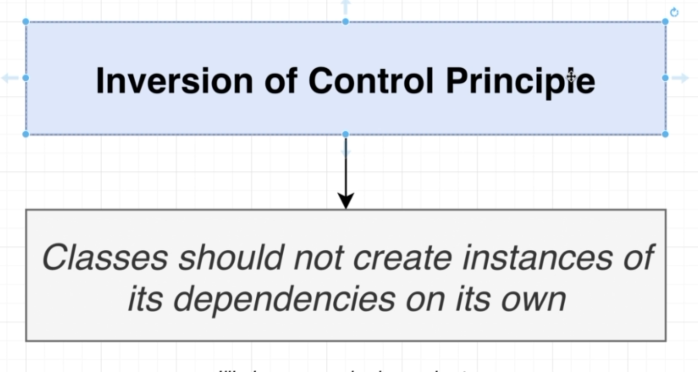
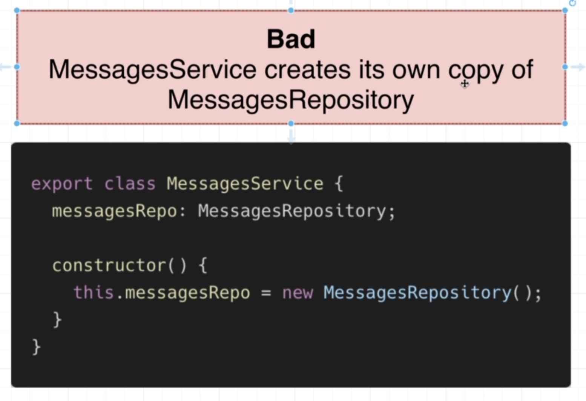
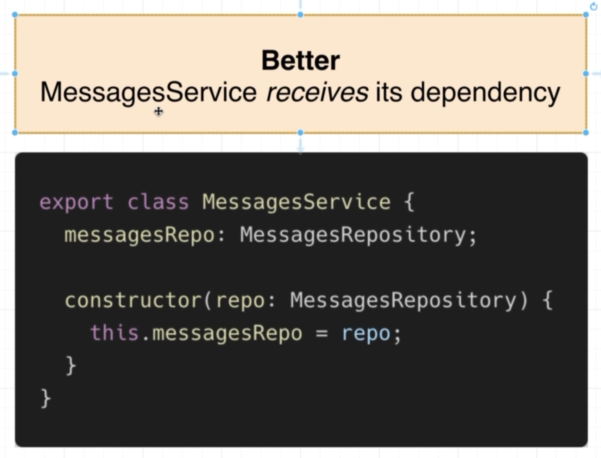
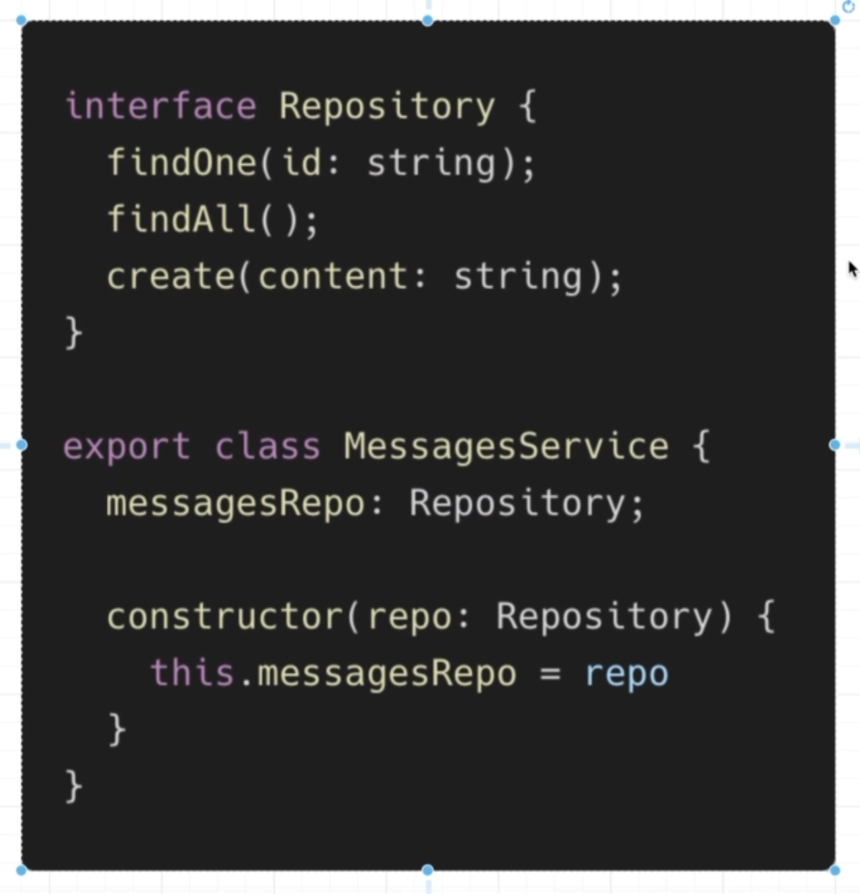
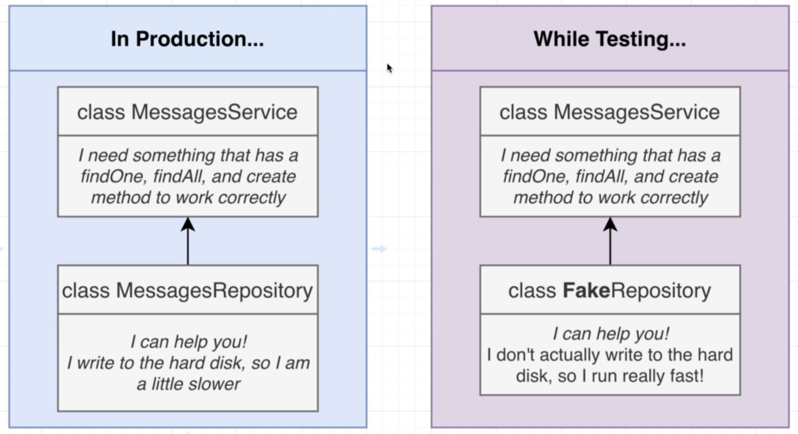

# NestJS | 9

### Bootcamp

[Discord](https://discord.gg/URhAqbTEJb) | [Official Documentation](https://docs.nestjs.com/)

[Kushagra Acharya](https://www.linkedin.com/in/kushagraacharya/)

---

## Disclaimer

- This is an optional course and will not effect your academic credit
- If you're not interested and cannot fullfill any requirement or class rules you will be resulted for class dropout.

---

## General Rules

- Having a laptop and a separate notebook is compulsory
- Faliure to answer at least 3 viva question will result in dissmissal.
- Faliure to complete homework/classwork without any valid result will be unacceptable.

---

## Prerequisite

- Separate notebook/copy for notes
- NVM with Node Installed
- PC with VS Code Installed
- Stable Internet Connection

---

## Messages Project Part 5 : Handling Errors

---

## Previously

- We learned about Services and its use
- How to Connect - Services + Repository + Controller

---

## Errors

- If we try to get a single message with a random `id` like `123123`
- We dont get a specific error
- We just get a blank response from the API
- We should be giving a specific error message

---

## Controller with NotFoundException

- In MessageController
- import `NotFoundException` from `@nestjs/common`
- Now inside the route handler which Gets by id
  - `const message = await this.messagesService.findOne(id);`
  - this will open the file and get the message with id as a promise
  - then in a if statement `if(!message)`
  - `throw new NotFoundException('message not found');`
  - `return message;`
- Check this route with or without valid `id`

---

## Other Exceptions

- Inside
  - `@nestjs>common>exceptions`
  - NestJS provided exception for you

#### Some commonly used are:

- BadRequestException
- GatewayTimeOutException
- UnAuthorizedException
- etc

---

### Dependency Injection Fix

- A little bit complicated and challenging concept
- Understanding why it is done?
- How to do it will be easy if you understand `Why`

---

## Dependency In Our Project



---

## Mapping the dependencies

- Service depends on Repository to work correctly
- So if there is no Repository to exist Service wont work correctly
- Controller depends upon the Service
- There is very clear depedency between these classes

---

## Creating on the Run

- To make our system work
  - MessageService is making MessageRepository object in it's constructor
  - Which means when we are creating an `object` of `MessageService` class, this class is `automatically` creating it's dependency of MessagesRepository
- In the same way when we create an instance of `MessagesController` it automatically creates its dependeny of `MessageService`

---

## Inversion of Control Principle



---

## It means

- If you want to write `REUSEABLE` code, the classes you have written `SHOULD NOT` create instances of its dependencies `ON ITS OWN`

---

## So this makes

- Inside MessagesController

```ts
constructor(){
    this.messagesService = new MessagesService();
}

```

- This principle make the following code BAD code
- Which means we should not try to create dependencies inside the class on our own

---

## Variations

- Bad
- Better
- Best

---

## Bad Practice



---

## Better Practice



---

## Best Practice


---

## Best Practice



---

## Why Interface

- In the Better Practice
  - The repo being passed to the constructor has to be MessageRepository
  - Other types of Repository is not entertained by the constrctor
- In Best Practice
  - The repo is generalized with an interface AND as long as any class satisfies the condition of interface Repository, it can be used by the MessageService

---

## So why?

- Question
- Why would MessageService need any other repository other than MessageRepository?
- It is not made to work with other type of Repository so why take a general form of interface which is accepted by the MessageService constructor?

---

## Reason



---

## Remember

Not always Inversion of Control helps!

If you follow inversion of control and start doing dependency injection to create a controller then a single line like this

```ts
const constroller = new MessagesController();
```

will be more than 2 lines which is a waste of time and effort.

So IoC is done only when it is suitable

---

## Dependency Injection

## END HERE 008 intro to DI 4:27

---

## Next

- Error handling, 404
