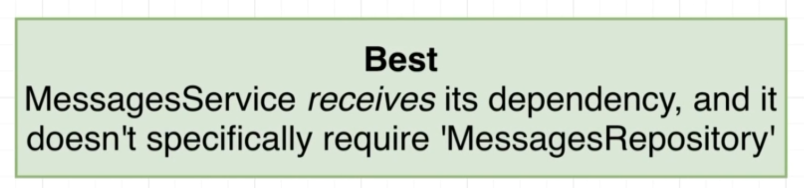
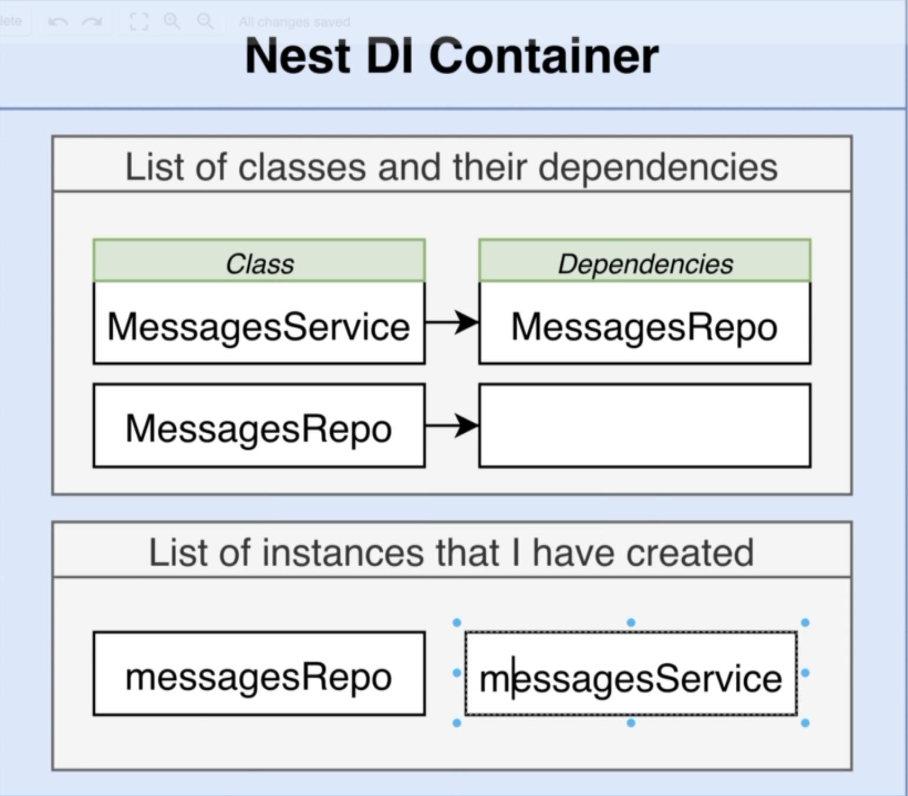
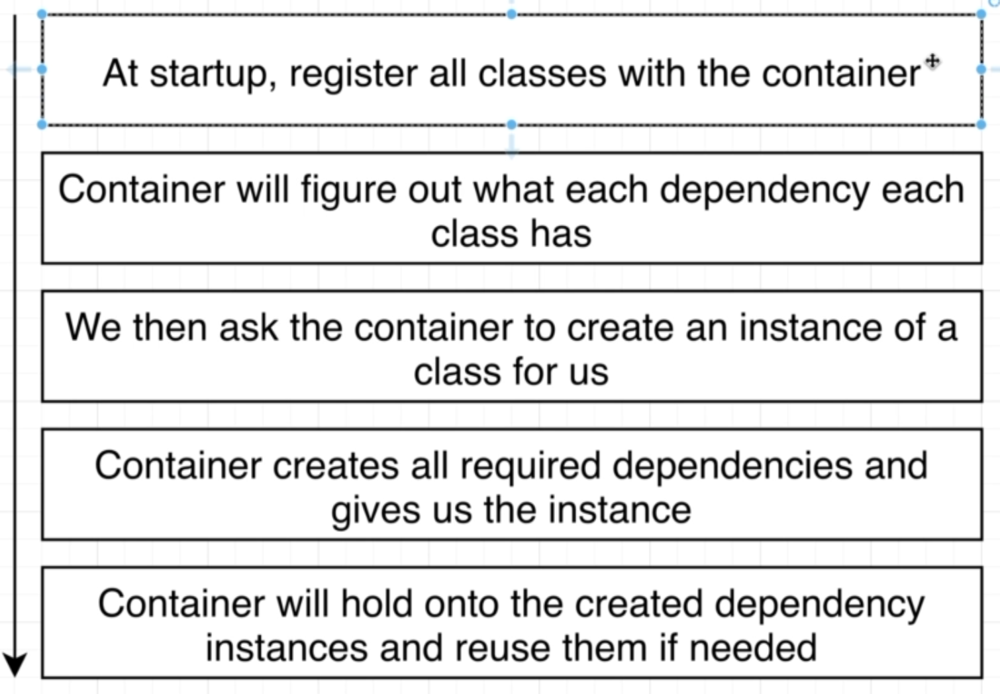

# NestJS | 9

### Bootcamp

[Discord](https://discord.gg/URhAqbTEJb) | [Official Documentation](https://docs.nestjs.com/)

[Kushagra Acharya](https://www.linkedin.com/in/kushagraacharya/)

---

## Disclaimer

- This is an optional course and will not effect your academic credit
- If you're not interested and cannot fullfill any requirement or class rules you will be resulted for class dropout.

---

## General Rules

- Having a laptop and a separate notebook is compulsory
- Faliure to answer at least 3 viva question will result in dissmissal.
- Faliure to complete homework/classwork without any valid result will be unacceptable.

---

## Prerequisite

- Separate notebook/copy for notes
- NVM with Node Installed
- PC with VS Code Installed
- Stable Internet Connection

---

## Messages Project Part 5 : Handling Errors

---

## Previously

- We learned about Services and its use
- How to Connect - Services + Repository + Controller

---

## Errors

- If we try to get a single message with a random `id` like `123123`
- We dont get a specific error
- We just get a blank response from the API
- We should be giving a specific error message

---

## Controller with NotFoundException

- In MessageController
- import `NotFoundException` from `@nestjs/common`
- Now inside the route handler which Gets by id
  - `const message = await this.messagesService.findOne(id);`
  - this will open the file and get the message with id as a promise
  - then in a if statement `if(!message)`
  - `throw new NotFoundException('message not found');`
  - `return message;`
- Check this route with or without valid `id`

---

## Other Exceptions

- Inside
  - `@nestjs>common>exceptions`
  - NestJS provided exception for you

#### Some commonly used are:

- BadRequestException
- GatewayTimeOutException
- UnAuthorizedException
- etc

---

### Dependency Injection Fix

- A little bit complicated and challenging concept
- Understanding why it is done?
- How to do it will be easy if you understand `Why`

---

## Dependency In Our Project


---

## Mapping the dependencies

- Service depends on Repository to work correctly
- So if there is no Repository to exist Service wont work correctly
- Controller depends upon the Service
- There is very clear depedency between these classes

---

## Creating on the Run

- To make our system work
  - MessageService is making MessageRepository object in it's constructor
  - Which means when we are creating an `object` of `MessageService` class, this class is `automatically` creating it's dependency of MessagesRepository
- In the same way when we create an instance of `MessagesController` it automatically creates its dependeny of `MessageService`

---

## Inversion of Control Principle


---

## It means

- If you want to write `REUSEABLE` code, the classes you have written `SHOULD NOT` create instances of its dependencies `ON ITS OWN`

---

## So this makes

- Inside MessagesController

```ts
constructor(){
    this.messagesService = new MessagesService();
}

```

- This principle make the following code BAD code
- Which means we should not try to create dependencies inside the class on our own

---

## Variations

- Bad
- Better
- Best

---

## Bad Practice


---

## Better Practice


---

## Best Practice



---

## Best Practice


---

## Why Interface

- In the Better Practice
  - The repo being passed to the constructor has to be MessageRepository
  - Other types of Repository is not entertained by the constrctor
- In Best Practice
  - The repo is generalized with an interface AND as long as any class satisfies the condition of interface Repository, it can be used by the MessageService

---

## So why?

- Question
- Why would MessageService need any other repository other than MessageRepository?
- It is not made to work with other type of Repository so why take a general form of interface which is accepted by the MessageService constructor?

---

## Reason


---

## Remember

Not always Inversion of Control helps!

If you follow inversion of control and start doing dependency injection to create a controller then a single line like this

```ts
const constroller = new MessagesController();
```

will be more than 2 lines which is a waste of time and effort.

```ts
const repo = new MessagesRepo();
const service = new MessagesService(repo);
const controller = new MessagesController(service);
```

So IoC is done only when it is suitable

---

## Dependency Injection

- So to solve this problem of creating massive number of objects just to create one object
- Like if a controller requires 3 services object, we have to make 3 services first and the pass it to the controller object

```ts
const service1 = new Service1();
const service2 = new Service2();
const service3 = new Service3();
const controller = new Controller(service1, service2, service3);
```

- We now look into dependency injection

---

## Working


---

## Working

- Nest DI Container / Injector is an object which

1.  `Stores` list of all the classes and their dependencies
2.  `Stores` instances that you have created

---

## Working

- When you create a NestJS app, DI Container is created for that app
- DI container stores all the class in the app except the Controllers
- The intelligent factor of DI is that if a class `MessageService` has a contructor that needs `MessagesRepository` to work, which is the dependency of the service, the DI stores the MessagesRepository (dependency) while storing the MessageService (class)
- The DI stores a list of relation map which describes which class needs which dependency
- Again after storing `MessageService` it creates a new relation of `MessagesRepo` which might not have any dependency

---

## Working


---

## Working

- So we now know that, at startup, the DI Container stores list of classes and their dependencies inside it which are mainly NOT `Controllers`

- After finishing all classes and dependencies, now the time comes to create the Controllers

```ts
export class MessagesController {
  messagesService: MessagesService;
  constructor(messagesService: MessageService) {
    this.messageService = messagesService;
  }
}
```

---

## Working

- So when its time to create the controller, these steps occur

1. We ask the `Injector` to create instance of our `Controller`
2. Injector looks at the `constructor` of the Controller and looks at what does the Controller has as dependencies
3. Injector sees that we need a copy of `MessagesService` and finds that it needs `MessagesRepo` first (see diagram)
4. Then it finds that `MessagesRepo` has no dependencies
5. So it makes the instance `repo` then make instance of `service`
6. When repo and service are made it makes a `controller` we need and gives us the instance
7. When it makes the instances it stores it to list number `2`

---

### Working



---

### Working

##### Goals of Injector

- Register all different classes and its dependencies
- Create Controllers using the classes and dependencies
- Give instance Controllers back when requested
- Do IoC and manage it itself
- The most useful part is that, if any other `Controller` like `UserController` needs instances of `messageRepo` and `messageService`, rather than making new instances, it reuses the previously created instances (more later)

---

### Working Flow



---

### Refactoring

- We now implement what we've learned to our existing code

---

### Service Refactor

- something like this for constructor in your `messages.repository.ts`

```ts
messagesRepo:MessagesRepostory;

constructor (messagesRepo:MessagesRepository){
  this.messages = messagesRepo;
}

```

or this typescript magic!

```ts
// messagesRepo:MessagesRepository;

constructor(public messagesRepo:MessagesRepository){

}
```

---

### Controller Refactor

- in your `messages.controller.ts`

```ts
constructor(public messagesService:MessagesService){

}
```

> We will have no change in our `messages.repository.ts` since there is no dependency for the repo

---

### Refactoring

- Now all we've done is mention the dependency for the respective classes
- So how do we let the DI Controller know that it should create the classes and the instances?
- In our case, how do we let the DI Container know that it should make the instance of `MessagesService` since it will be later used by the `MessagesController`?
- We do this using the provided decorators

---

### DI Flow


---

### Decorator

- We import decorator and apply it to class
- Add the decorated classes to module

---

### Decorator Injectable

- in `messages.service.ts`

- import `Injectable` from `nestjs/common`;

- decorate `MessagesService` class with `@Injectable()`

- do same for the `messages.repository.ts`

- we dont have to do this for any Controllers

---

### Adding to Modules

- open `messages.module.ts`
- import `MessagesService` and `MessagesRepository`
- add the classes as providers

```ts
@Module(
  {
    controllers: [MessagesController],
    providers: [
      MessagesService,
      MessagesRepository
    ]
  }
)
```

> providers = things that can be used as dependencies for other classes

- refactor completed!

---

### Run

- Close the server and re-run it
- Check if all things are working correctly

---

### DI Conclusion (Open Image of DI Container)

- all serives and repos should have dependency injected
- this is the BETTER approach, instead of the BEST approach
- whenever a instance is made by the DI Container, it will reuse that instance if you ask it again
- 1st list keeps the map of what is created
- 2nd list keeps the instance that are alive
- all instances asked by the app is given from the 2nd list

---

### DI Conclusion

- What is the benefit of DI over previous approach?
  - It is not suitable always
  - Testing individual classes is very easy
  - Finding bugs is super easy
- Writing testing in super helpful and easy

---

### We completed!

- NestJS Architecture - DI with Services and Repo

---

### Next Class

- We will starting NestJs Architecture with Modules with DI
